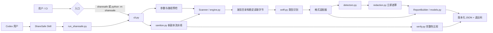
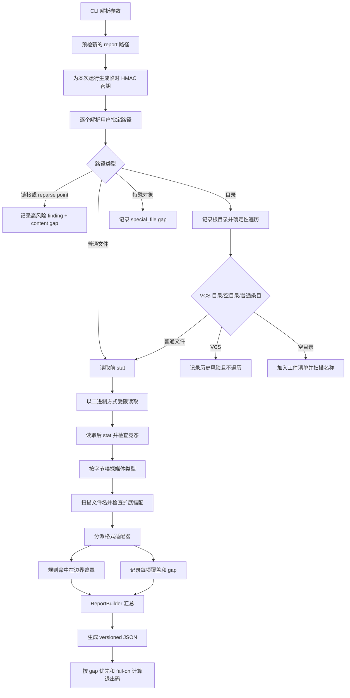
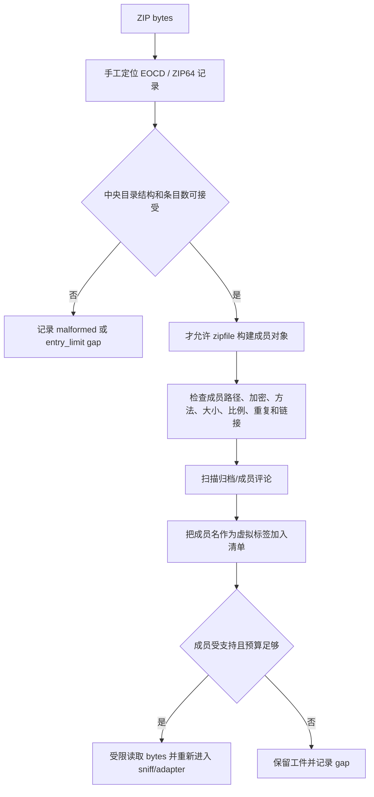
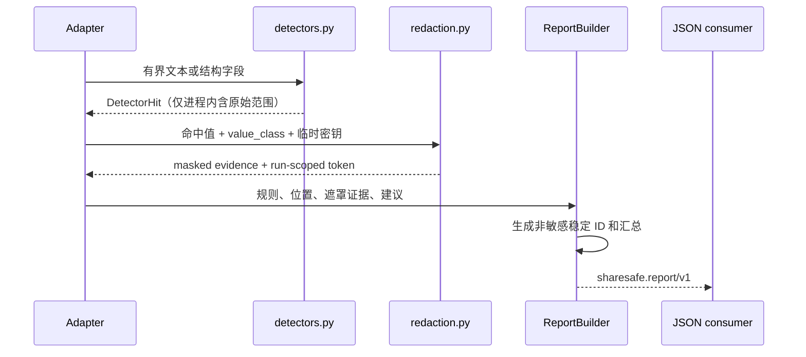
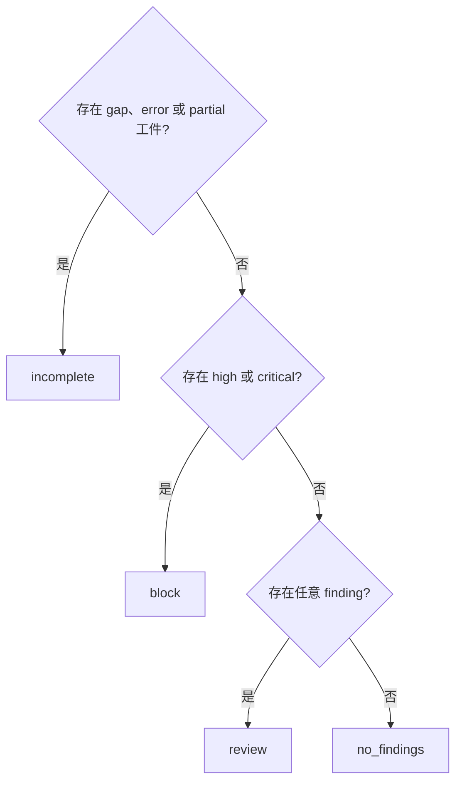
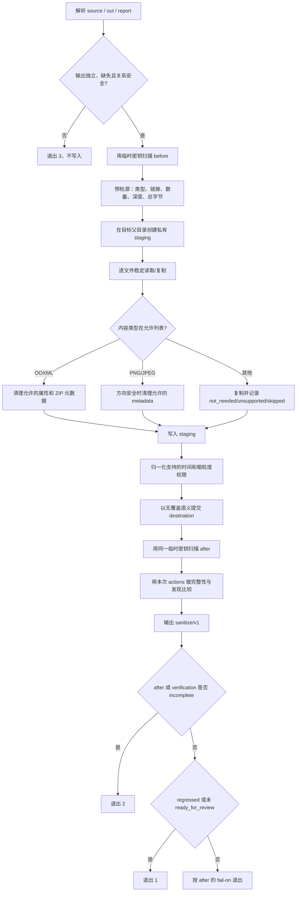
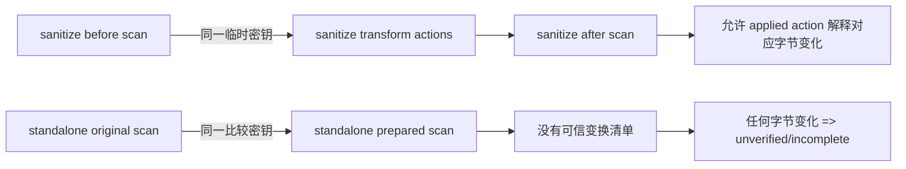
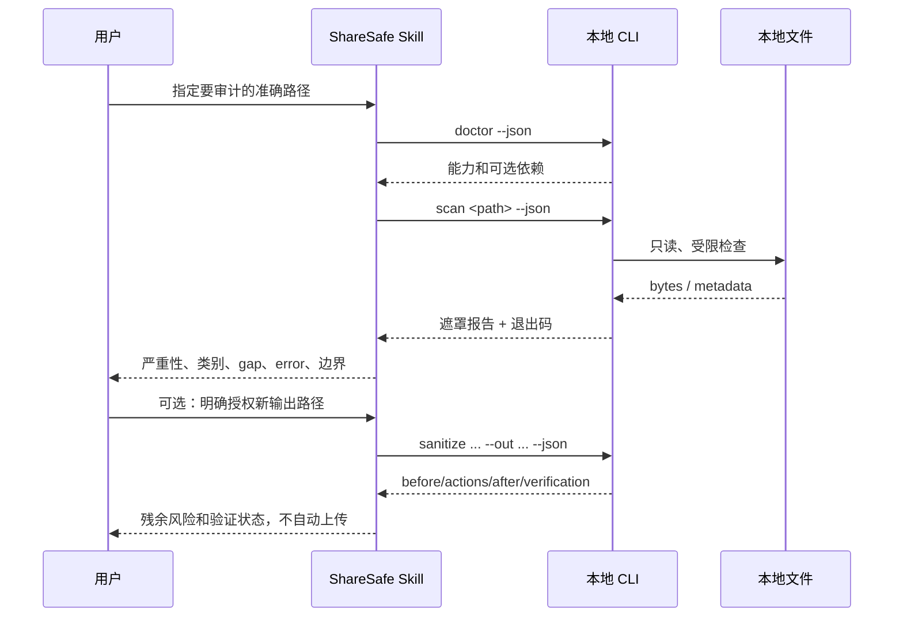
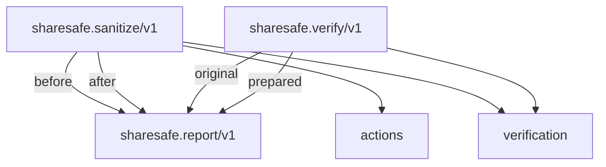

# ShareSafe v0.1 设计方案与各部分流程

本文解释 ShareSafe `0.1.x` 的设计目标、组件职责、信任边界、数据模型，以及扫描、净化、验证、Skill 调用、测试和发布的完整流程。它是中文导览，不替代规范性文件：实现发生变化时，应优先以 [设计契约](design-contract.md)、[架构基线](architecture.md)、[支持矩阵](../SUPPORT_MATRIX.md)、[威胁模型](../THREAT_MODEL.md) 和版本化 JSON schema 为准。

## 目录

1. [问题与设计目标](#1-问题与设计目标)
2. [核心原则和不可破坏的不变量](#2-核心原则和不可破坏的不变量)
3. [总体架构](#3-总体架构)
4. [代码与文档组件职责](#4-代码与文档组件职责)
5. [核心数据模型](#5-核心数据模型)
6. [扫描流程](#6-扫描流程)
7. [格式适配器流程](#7-格式适配器流程)
8. [检测、遮罩与报告流程](#8-检测遮罩与报告流程)
9. [结论和退出码流程](#9-结论和退出码流程)
10. [净化流程](#10-净化流程)
11. [验证流程](#11-验证流程)
12. [Codex Skill 流程](#12-codex-skill-流程)
13. [路径、文件系统与提交安全](#13-路径文件系统与提交安全)
14. [资源限制和恶意输入防护](#14-资源限制和恶意输入防护)
15. [JSON schema 和自动化边界](#15-json-schema-和自动化边界)
16. [测试体系](#16-测试体系)
17. [CI 与发布流程](#17-ci-与发布流程)
18. [扩展和变更流程](#18-扩展和变更流程)
19. [主要设计取舍](#19-主要设计取舍)
20. [规范来源与维护规则](#20-规范来源与维护规则)

## 1. 问题与设计目标

### 1.1 要解决的问题

文件在离开本机之前，泄露风险不只存在于正文：

- 文件名和目录名可能包含姓名、邮箱、电话或本机用户名；
- 源码和配置可能包含凭据、私钥或服务 token；
- Office、PDF 和图片可能保留作者、公司、软件、设备、GPS、时间和修订信息；
- 批注、修订、演讲者备注、隐藏工作表/幻灯片和嵌入对象可能不在普通阅读视图中；
- ZIP、wheel 等容器可能嵌套其他文件、评论、危险路径或极端压缩内容；
- 扫描器自身的报告、错误信息和文件摘要也可能形成二次泄露；
- 自动化可能只看退出码 `0`，忽略其实未完成的检查。

ShareSafe 被设计为放在“可信本地边界”与“上传、发送、发布”之间的证据门。它要回答三个问题：

1. 检测到了哪些可能的披露风险？
2. 哪些相关表示没有被完整检查？
3. 如果创建了新副本，实际改变了什么，输出又被检查到了什么？

它不回答“是否依法可以发布”，也不生成绝对无风险证明。

### 1.2 v0.1 的目标

- 本地、离线、确定性地检查支持的文件表示。
- 让覆盖缺口和发现一样成为一等数据。
- 在发现产生的边界立刻遮罩证据。
- 默认只读；任何变换都写入新路径并保留原件。
- 净化能力窄于检测能力，只做允许列表内的高置信元数据变换。
- 变换后立即复扫，并通过工件完整性比较防止“删除内容后发现变少”的假改进。
- 提供稳定、可版本化的 JSON 和明确退出码。
- 让 Codex Skill 只负责编排和解释，不把隐私判断变成模型自由发挥。

### 1.3 明确非目标

- 恶意软件检测或主动内容安全执行；
- OCR、视觉/音频/视频语义分析；
- 完整正文或像素级不可逆脱敏；
- 合规认证、法律意见或组织审批替代；
- PDF 改写、所有格式解析或任意归档重建；
- 安全擦除、文件系统取证匿名化或对操作系统/备份服务的防护。

## 2. 核心原则和不可破坏的不变量

| 原则 | 不变量 |
|---|---|
| 本地优先 | 正常扫描、报告、净化和验证不需要网络；适配器不获取外部关系 |
| 默认只读 | `scan`、`verify` 不修改输入；`sanitize` 只创建不同且不存在的输出 |
| 覆盖诚实 | 不支持、加密、损坏、解析失败、依赖缺失和资源耗尽必须成为 gap |
| 失败关闭 | 相关 gap、error 或 partial 工件使总体结论为 `incomplete`，退出码优先为 `2` |
| 证据先遮罩 | 裸 PII、凭据、用户名、主机名、绝对根路径和元数据值不能进入公共报告 |
| 内容不执行 | 不运行宏、脚本、公式、外链或嵌入对象，不把归档成员当作可执行路径 |
| 变换有允许列表 | 只允许受审查的 OOXML/PNG/JPEG 元数据变换，其他内容复制或明确拒绝 |
| 输出必复扫 | 创建副本不等于验证成功；`sanitize` 必须包含 after scan 和完整性比较 |
| 版本化契约 | 破坏 JSON 字段或语义必须提升 schema 或作显式版本决策 |
| 范围不扩张 | 扫描一个路径不授权扫描兄弟目录、安装依赖、创建副本或上传结果 |

## 3. 总体架构

ShareSafe 分成“交互编排层”和“确定性执行层”。



### 3.1 两层的边界

**Skill 层负责：**

- 判断何时使用 ShareSafe；
- 保留用户授权范围；
- 先检查能力，再选择 scan/sanitize/verify；
- 解释遮罩发现、gap 和退出码；
- 避免把结果扩大为发布许可。

**Python 层负责：**

- 路径安全、稳定读取、类型判断和资源计数；
- 格式解析、规则检测和证据遮罩；
- 报告 schema、ID、HMAC 内容令牌、结论和退出码；
- staging、允许列表变换、无覆盖提交和前后验证。

这样设计是为了让隐私关键逻辑可单元测试、可跨平台复现，而不是依赖每次对话的表述。

## 4. 代码与文档组件职责

### 4.1 入口和编排

| 路径 | 职责 | 关键边界 |
|---|---|---|
| `skills/sharesafe/SKILL.md` | Skill 的触发范围、必需流程和授权规则 | 保持简短；不复制检测逻辑 |
| `skills/sharesafe/agents/openai.yaml` | UI 名称、简介、默认提示和隐式调用策略 | 必须与 SKILL 描述一致 |
| `scripts/run_sharesafe.py` | 从 Skill 目录启动内置 Python 包 | 不依赖全局安装的同名包 |
| `sharesafe/__main__.py` | `python -m sharesafe` 入口 | 交给 CLI 统一处理 |
| `sharesafe/cli.py` | 参数、报告目标预检、输出格式、退出码和稳定错误包络 | JSON stdout 可解析；异常路径不外泄 |

### 4.2 扫描核心

| 模块 | 职责 | 关键不变量 |
|---|---|---|
| `engine.py` | 路径发现、目录遍历、稳定读取、工件清单、类型分派 | 不跟随链接；绝对根不进报告 |
| `path_safety.py` | 路径包含关系和 Windows ADS 判断 | 输入、输出和报告关系失败关闭 |
| `limits.py` | 所有共享资源预算和大小参数解析 | 达到限制产生 gap，不静默截断 |
| `sniff.py` | 根据字节签名和受限结构判断媒体类型 | 扩展名只作辅助；错配产生发现 |
| `catalog.py` | `rules` 与 `formats` 的稳定公开目录 | 文档和 CLI 能发现能力边界 |
| `detectors.py` | 确定性规则、校验器和结构化命中 | 不负责序列化裸证据 |
| `redaction.py` | 遮罩、展示路径处理、临时 HMAC 令牌 | 报告不可包含裸匹配或原始摘要 |
| `models.py` | Artifact/Finding/Gap、汇总、结论和退出码 | `incomplete` 优先；ID 不基于敏感值 |
| `reporting.py` | JSON/人类摘要及报告文件原子写入 | 报告只创建不覆盖 |

### 4.3 格式适配器

| 模块 | 输入表示 | 主要职责 |
|---|---|---|
| `adapters/text.py` | 解码后的受限文本 | 调用检测规则并记录文本覆盖 |
| `adapters/archive.py` | ZIP 结构和成员字节 | 成员清单、评论、路径风险和受限递归 |
| `zip_safety.py` | ZIP/ZIP64 中央目录字节 | 在创建大量 `ZipInfo` 前预检条目数和结构 |
| `adapters/ooxml.py` | OOXML ZIP/XML 包 | 属性、关系、正文 XML、隐藏/活动结构信号 |
| `ooxml_xml.py` | XML 字节 | 拒绝 DTD/entity，提供确定性结构检查 |
| `adapters/pdf.py` | PDF 字节 | 内置结构/元数据检查和可选 `pypdf` 文本检查 |
| `adapters/image.py` | PNG/JPEG/TIFF/WebP 字节 | 受限块/段/标签检查和可选 Pillow 能力 |

### 4.4 写入和比较

| 模块 | 职责 | 关键不变量 |
|---|---|---|
| `sanitize.py` | 源预检、staging、允许列表变换、独占提交、元数据归一化 | 不覆盖、不改原件、不扩大变换范围 |
| `verify.py` | 比较前后工件、内容令牌和发现多重集 | 无可信动作时，任何字节变化均为 unverified |

### 4.5 契约和验证材料

| 路径 | 用途 |
|---|---|
| `schemas/*.schema.json` | 扫描、净化和验证的 v1 机器契约 |
| `SUPPORT_MATRIX.md` | 格式和变换的规范性支持边界 |
| `THREAT_MODEL.md` | 资产、信任边界、威胁、缓解和残余风险 |
| `docs/design-contract.md` | 不得无版本决策漂移的行为契约 |
| `tests/` | 只使用合成数据的单元、对抗、集成和回归测试 |
| `.github/workflows/` | 跨平台测试、打包校验和标签发布 |

## 5. 核心数据模型

### 5.1 Artifact

每个被发现的文件、目录、空目录、归档成员或虚拟容器项都可以成为工件。主要字段包括：

- `id`：由非敏感路径身份、媒体类型和出现次序生成的稳定 ID；
- `path`：去除绝对扫描根并经过身份路径遮罩的展示路径；
- `content_token`：本次运行密钥下的 HMAC 字节令牌；目录或未读取项可以为空；
- `size`：已读取工件的字节数；
- `media_type`：按内容识别的媒体类型；
- `status`：`scanned` 或 `partial`；
- `coverage`：`text`、`metadata`、`hidden_content`、`embedded_objects`、`ocr` 的独立状态。

内容令牌不是公开 SHA-256。它使用只存在内存中的临时密钥，因此同一对比运行可以判断字节是否相同，报告持有者却不能用候选文件摘要离线枚举内容。

### 5.2 Finding

Finding 表示已经检测到的风险信号：

- 关联 `artifact_id`；
- 使用稳定 `rule_id`、类别、严重性和置信度；
- 位置是结构化偏移、部件或文件名位置；
- `evidence` 在进入报告对象前已经遮罩；
- `remediation` 只描述是否支持自动处理和建议动作。

Finding ID 由工件身份、规则、结构位置和出现次数生成，不对裸敏感值或原始文件字节做普通哈希。

### 5.3 Gap

Gap 不是低优先级 warning，而是“某项相关能力没有完成”的正式记录：

- `capability` 表明受影响的检查；
- `reason` 提供稳定机器原因；
- `detail` 使用不泄露路径/内容的说明；
- 可以关联单个工件，也可以作用于整个扫描。

一旦出现 gap，工件会被标记为 partial/unsupported，总体结论进入 `incomplete`。

### 5.4 ReportBuilder

`ReportBuilder` 是唯一受支持的扫描报告构建器，负责：

- 确定性添加工件和发现；
- 在单工件或全局发现上限处创建 gap；
- 去重相同 gap；
- 统计严重性和工件状态；
- 计算固定优先级结论；
- 根据用户阈值计算退出码；
- 生成 `sharesafe.report/v1`。

## 6. 扫描流程



### 6.1 参数和报告目标预检

`cli.py` 在扫描前确认 `--report`：

- 不使用 Windows alternate data stream 语法；
- 不覆盖现有文件或符号链接；
- 不在被扫描目录内部；
- 不与扫描文件发生同路径或包含冲突。

预检失败使用稳定 `sharesafe.error/v1` 包络并退出 `3`，不会把底层异常路径复制到输出。

### 6.2 发现与目录边界

`Scanner.scan()` 把命令行路径转为绝对路径仅用于本地访问，但报告只保留相对展示标签。目录项在平台允许时按不区分大小写的排序稳定遍历。

关键处理包括：

- 选中的根目录本身进入清单；
- 空目录进入清单，便于验证时发现删除；
- 如果根目录是系统用户容器下的个人目录，展示名替换为 `<user>`；
- `.git`、`.hg`、`.svn` 不被递归读取，而是产生高风险历史信号和 gap；
- 符号链接、reparse point 和特殊文件不跟随；
- 多输入各自保留独立根标签。

### 6.3 稳定读取

普通文件读取过程比较：

1. 打开前 `stat`；
2. 已打开句柄的 `fstat`；
3. 读取完成后的 `stat`。

设备、inode、大小或修改时间发生变化时，即使已有字节被检查，也会增加 `file_changed_during_scan` gap。读失败、过大或总预算耗尽同样不会被表示为完整。

### 6.4 类型识别与分派

`sniff.py` 先看内容签名和结构，再把扩展名作为辅助信息。这样：

- 改名 ZIP 仍进入归档解析器；
- `invoice.pdf.exe` 一类错配会产生 `SS-GEN-TYPE-MISMATCH`；
- 未知二进制不会被当作普通文本“成功扫描”；
- OOXML 需要同时满足 ZIP/包结构和扩展条件。

## 7. 格式适配器流程

所有适配器接收已经读入的不可变 `bytes`、展示用虚拟路径、Limits、当前递归深度和 ReportBuilder。适配器不得重新打开任意文件、写入磁盘、访问网络或执行内容。

### 7.1 文本

```text
bytes -> 有界解码 -> 可搜索文本 -> deterministic rules
      -> masked finding + text coverage
```

编码无法可靠解释或超出文本预算时，相关文本覆盖变为 partial，而不是返回空结果。

### 7.2 ZIP 和嵌套归档



成员从不被提取到其自带路径。虚拟展示路径使用 `container!/member` 形式；全局展开字节预算跨嵌套层级共享。

### 7.3 OOXML

OOXML 适配器把 Word、Excel、PowerPoint 看作受约束的 ZIP/XML 包：

1. 执行 ZIP 预检和成员安全检查；
2. 验证关键包部件和媒体类型；
3. 遍历有界 XML/relationship 部件；
4. 拒绝 DTD/entity，损坏 XML 产生 gap，并对可用原始文本执行受限回退检查；
5. 检查 core/app/custom properties；
6. 检查正文 XML、共享字符串和非 XML 部件名；
7. 识别批注、修订、备注、隐藏表/幻灯片、外链、宏、签名、custom XML、ActiveX 和嵌入对象信号；
8. 对无法解释的嵌入二进制只报告存在，不执行或改写。

“能检测到”不等于“能自动移除”。这一分离是 v0.1 最重要的能力边界之一。

### 7.4 PDF

PDF 适配器有两层：

- 内置字节级元数据和结构 token 检查；
- 可选 `pypdf` 的可提取页面文本和基础对象检查。

即使安装 `pypdf`，深层结构仍保持部分覆盖；加密、解析失败、超过页数、图片型页面、附件和复杂增量历史都可能需要其他工具。v0.1 没有 PDF 写入适配器。

### 7.5 图片

- PNG 解析器按块遍历，限制总块数，对 zTXt/iTXt 使用严格格式校验和累计解压文本预算。
- JPEG 解析器按 segment 遍历，识别 EXIF、XMP、IPTC、评论和设备信息。
- Pillow 可增加 TIFF/WebP 及更丰富标签检查。
- 像素始终不进入 OCR 或语义识别流程。

## 8. 检测、遮罩与报告流程



### 8.1 规则层

规则以稳定前缀分组：

- `pii.*`：邮箱、中国大陆手机号、校验通过的居民身份证号和 Luhn 卡号等；
- `secret.*`：私钥标记、特定 provider token、JWT 和凭据赋值；
- `privacy.*`：可能暴露账户身份的用户主目录路径；
- `unicode.*`：双向和零宽控制字符；
- `SS-GEN-*`：文件系统、敏感文件名、链接、VCS、可执行文件和类型错配；
- `SS-ARCHIVE-*`、`SS-OOXML-*`、`SS-PDF-*`、`SS-IMAGE-*`：格式专用结构信号。

规则增加时必须同时定义 ID、类别、严重性、置信度、正反例、边界测试、遮罩策略和误报分析。

### 8.2 遮罩边界

检测命中在转换为 Finding 时立即经过 `redaction.py`。允许保留的只有审阅所需的类别信息，例如：

- 值类型；
- 策略允许的少量前/后缀；
- 长度桶；
- 结构位置；
- 本次运行内的关联 token。

禁止进入报告的内容包括裸匹配、识别出的用户名/主机名、绝对扫描根、原始文件 SHA 摘要和底层异常字符串。

### 8.3 为什么报告仍需保护

即使证据已经遮罩，报告仍可能泄露：

- 相对文件名和目录结构；
- 文件大小和媒体类型；
- 风险类别与数量；
- 组织使用了哪些工具或格式。

因此报告默认保留本地，不自动上传。

## 9. 结论和退出码流程

### 9.1 结论算法



发现不会因为出现 gap 而丢失。`incomplete` 报告仍保留已经检测到的风险，让用户既看到明确问题，也知道哪些部分尚未检查。

### 9.2 退出码算法

扫描退出码与结论相关但不相同：

```text
if gap or error or partial artifact:
    exit 2
elif fail_on == never:
    exit 0
elif any finding severity >= fail_on:
    exit 1
else:
    exit 0
```

固定参数/操作错误退出 `3`，文件系统或内部失败退出 `4`。结论 `review` 可以在默认 high 阈值下退出 `0`；结论 `block` 也可以在 `--fail-on never` 下退出 `0`。自动化必须检查两者。

## 10. 净化流程

净化是独立编排路径，不是给扫描器开启写权限的开关。



### 10.1 路径预检

`create_sanitized_copy()` 在创建 staging 前拒绝：

- 源不存在；
- 目标已存在或是链接；
- 源与目标相同；
- 目录目标位于源目录内部；
- 源或目标使用 Windows ADS；
- 源是链接/reparse point；
- 源树包含链接、特殊文件，或超过文件数、深度、总字节预算。

### 10.2 Staging 与提交

staging 位于目标父目录中，以减少跨文件系统提交差异。提交策略按平台和工件类型选择：

- 文件优先使用 hardlink no-replace；不可用时使用 `O_EXCL` 独占创建并同步写入；
- Windows 目录使用不替换的 rename；
- POSIX 目录先以独占语义保留目标目录，再迁移成员；失败时回收未完成目标；
- 竞争过程中出现目标时立即拒绝，不覆盖他人创建的数据；
- 已经达到提交点的结果不会在后续异常中被静默删除。

### 10.3 变换允许列表

验证层只承认三类 `applied` 动作：

- OOXML 的 `remove_ooxml_metadata`；
- PNG 的 `strip_png_metadata`；
- JPEG 的 `strip_jpeg_metadata`。

而且动作路径和前后媒体类型必须一致。`skipped`、`partial`、`unsupported` 或 `failed` 都会造成完整性问题和总体不完整。

### 10.4 OOXML 写入防护

OOXML 在重建 ZIP 前会检查：

- 包结构和主部件匹配；
- 重复/危险成员名、链接、加密和资源预算；
- 所有 XML/relationship 部件都能安全解析且没有 DTD/entity；
- 没有宏、嵌入 OLE/ActiveX 或数字签名；
- 自定义属性引用能够确定性解析。

任一条件不满足都复制原字节并标记 skipped，而不是冒险修改包。

### 10.5 图片方向防护

JPEG/PNG 的 EXIF Orientation 不是普通隐私标签：盲目删除会改变查看器中的显示方向。ShareSafe 只有在 EXIF 结构可解析且方向缺失或为 `1` 时才删除该段；否则保留整个 EXIF，并把动作标记为 skipped/partial。

## 11. 验证流程

### 11.1 比较对象

`verify.py` 比较：

- 前后工件数量和按 path 分组的清单；
- 媒体类型；
- 字节大小；
- 使用同一临时密钥生成的 HMAC 内容令牌；
- Finding 的语义键和出现次数；
- 前后覆盖结论；
- 本次 `sanitize` 提供的可信动作。

### 11.2 完整性状态

| 状态 | 条件 |
|---|---|
| `preserved` | 工件一一对应，类型、大小和内容令牌均未改变 |
| `transformed` | 仅存在由同次 sanitize 的 allowlisted/applied 动作解释的变化 |
| `unverified` | 工件新增/删除、类型变化、重复身份歧义、未知字节变化或不完整动作 |

### 11.3 发现比较状态

| 状态 | 条件 |
|---|---|
| `unchanged` | 没有发现被解决或新增，覆盖和完整性可比较 |
| `improved` | 有发现消失，且没有新增，完整性得到解释 |
| `regressed` | 出现新的发现 |
| `incomplete` | 任一侧覆盖不完整，或工件完整性为 unverified |

发现比较按多重集处理：同一规则、位置和遮罩 token 的重复出现不会被集合去重掩盖。

### 11.4 sanitize 内置验证与 standalone verify 的差异



只有正在执行的 `sanitize` 拥有可信的进程内动作记录。事后独立 `verify` 不能认证过去或第三方工具做了什么，所以故意更保守。

## 12. Codex Skill 流程



Skill 的渐进披露结构为：

1. `name`/`description` 用于准确触发；
2. `SKILL.md` 保存共同流程和硬边界；
3. `references/workflow.md` 解释命令选择和停止条件；
4. `references/report-contract.md` 供 JSON 消费和自动化读取；
5. `references/security-boundaries.md` 供保证、失败和范围判断。

Skill 不应把每次扫描都加载全部参考资料，也不应在没有写入授权时主动调用 `sanitize`。

## 13. 路径、文件系统与提交安全

### 13.1 展示路径和访问路径分离

扫描器内部可使用绝对路径访问用户明确指定的目标，但传给适配器和报告的是清理后的展示路径。身份型 home/UNC 路径在规则边界遮罩，源根不进入 JSON。

### 13.2 链接和特殊对象

- 扫描不会跟随 symlink/reparse point；
- sanitize 直接拒绝含链接的源树；
- socket、device、FIFO 等特殊对象不读取；
- ZIP 成员名只作为字符串/虚拟标签，从不直接映射为磁盘目标。

### 13.3 竞态

读取前/中/后身份比较负责发现扫描期间替换文件的 TOCTOU 情况。净化的 `_stable_read` 和 `_stable_stream_copy` 也执行对应检查；提交目标采用不覆盖原语应对并发出现的同名路径。

### 13.4 输出父目录是信任边界

ShareSafe 不复制源的全部 ACL、所有者、扩展属性或备用数据流。输出继承目标父目录的安全属性，因此用户必须先选择访问控制合适的位置。净化树是发布副本，不是文件系统保真备份。

## 14. 资源限制和恶意输入防护

| 预算 | 默认值 | 防护对象 |
|---|---:|---|
| `max_file_bytes` | 50 MiB | 单文件读取和内存分配 |
| `max_total_file_bytes` | 1 GiB | 大目录总量 |
| `max_files` | 20,000 | 超大目录/条目枚举 |
| `max_directory_depth` | 64 | 深目录递归 |
| `max_text_bytes` | 16 MiB | 解码和规则扫描 |
| `max_findings_per_artifact` | 1,000 | 单工件报告膨胀 |
| `max_findings_total` | 10,000 | 全局报告膨胀 |
| `max_archive_entries` | 2,000 | ZIP 对象创建和遍历 |
| `max_archive_member_bytes` | 32 MiB | 单成员解压 |
| `max_expanded_bytes` | 256 MiB | 全局嵌套解压总量 |
| `max_compression_ratio` | 200 | 压缩炸弹 |
| `max_archive_depth` | 3 | 嵌套容器递归 |
| `max_xml_bytes` | 16 MiB | OOXML/XML 解析 |
| `max_pdf_pages` | 500 | 可选 PDF 页面遍历 |

防护采用“两次检查”思路：尽可能先根据声明大小和中央目录拒绝，再在真正读取时限制实际字节。达到发现上限也会生成 gap，防止截断后的报告看起来完整。

## 15. JSON schema 和自动化边界

### 15.1 schema 关系



仓库的三个 JSON Schema 使用稳定 `$id`：

- `urn:sharesafe:schema:report:v1`
- `urn:sharesafe:schema:sanitize:v1`
- `urn:sharesafe:schema:verify:v1`

离线消费者应把三个本地 schema 注册到以 `$id` 为键的 registry，不允许验证器从网络获取引用。

### 15.2 CLI 输出边界

- `--json` 时 stdout 只包含机器 JSON；
- 人类诊断写入 stderr；
- 参数、文件系统和内部错误使用 `sharesafe.error/v1` 稳定消息；
- 原始 exception string 不进入公共包络；
- `--report` 只创建新文件，并采用原子写入语义。

### 15.3 消费者规则

消费者必须同时验证 schema、必需字段、已知 verdict/coverage、退出码和 gap。未知版本不能静默按 v1 读取；报告字段永远视为不可信字符串，不能拼接成 HTML、命令或可执行路径。

## 16. 测试体系

全部测试只使用合成数据，分成四层。

### 16.1 单元测试

覆盖规则校验、类型 sniff、遮罩、HMAC、稳定 ID、limits 和结论优先级。典型文件：

- `test_detectors.py`
- `test_engine.py`
- `test_path_safety.py`
- `test_schema.py`

### 16.2 适配器和对抗输入测试

覆盖有效、空、损坏、加密、过大、深层、扩展错配、危险成员名和解析器差异：

- `test_archive.py`
- `test_archive_comments.py`
- `test_zip_preflight.py`
- `test_ooxml.py`
- `test_ooxml_hardening.py`
- `test_png_limits.py`

### 16.3 写入和验证测试

验证原件不变、输出关系拒绝、staging/提交、变换允许列表、复扫和完整性比较：

- `test_sanitize_verify.py`
- `test_malformed_sanitize.py`
- `test_name_inventory.py`

### 16.4 CLI、隐私和回归测试

验证 stdout/stderr、JSON、退出码、路径隐藏、错误卫生和历史缺陷：

- `test_cli.py`
- `test_cli_error_privacy.py`
- `test_security_regressions.py`

### 16.5 Skill 行为测试

新鲜代理上下文应验证：

- 能否在分享前审计请求中正确触发；
- 是否默认只读并先运行 doctor；
- 是否解释 incomplete 而不说成未发现风险；
- 是否在没有明确输出路径/授权时拒绝写入；
- 是否不索要或复述裸证据；
- 是否正确区分 sanitize 内置验证和 standalone verify。

可复现记录位于 [skill-evaluation.md](skill-evaluation.md)。

## 17. CI 与发布流程

### 17.1 普通 CI


矩阵测试先通过后，单独的 package job 才构建分发包。wheel 和由 sdist 重建的 wheel 都在新虚拟环境中以 `--no-index --no-deps` 安装，并运行 `pip check`、版本、doctor、self-test 和 smoke scan。

### 17.2 标签发布

```text
创建并推送 vX.Y.Z tag
  -> 六个平台/Python 组合测试
  -> 再次验证 Skill 和完整测试
  -> 构建 wheel + sdist
  -> twine / manifest / tag-version 检查
  -> 从 sdist 重建 wheel并安装验收
  -> 生成 SHA256SUMS
  -> gh release create --verify-tag
```

Release job 只有在所有标签测试通过后获得 `contents: write`。checkout、setup-python 和 upload-artifact 使用固定提交，而不是浮动 tag；checkout 禁用持久凭据。发布资产包含 wheel、sdist 和 `SHA256SUMS`。

### 17.3 发布后反向验收

一次完整发布还应从公开 Release URL 重新下载实际资产，而不是只信任构建工作区：

1. 比对 GitHub API digest、`SHA256SUMS` 和本地 SHA-256；
2. 在全新环境用 `--no-index --no-deps` 安装下载 wheel；
3. 运行 `pip check`、version、doctor 和 self-test；
4. 用下载得到的 CLI 扫描 wheel；
5. 确认没有 high/critical、gap 或 error，并保留所有 review 级别结果；
6. 确认 tag、release commit、`origin/main` 和本地工作树状态。

## 18. 扩展和变更流程

### 18.1 新增规则

```text
威胁/用例 -> 稳定 rule ID -> 精确模式与校验
         -> 正例/反例/边界/Unicode 测试
         -> 遮罩策略和裸值缺失断言
         -> catalog / 文档 / changelog
```

短且常见的字符串必须做误报分析；调试时也不能打印裸匹配。

### 18.2 新增格式适配器

需要同时交付：

1. 明确声明检查哪些表示、不检查哪些表示；
2. 内容 sniff 规则，而不是只看扩展名；
3. 不可变 bytes 适配器，不打开任意路径；
4. 加密、损坏、空、过大、错配和嵌套 fixture；
5. 资源预算和 parser exception 到 gap 的映射；
6. 可选依赖缺失行为；
7. 支持矩阵和威胁模型更新。

### 18.3 新增 sanitizer

检测能力不能自动转化为写入授权。新增变换必须先有：

- 高置信、格式精确的允许列表；
- 源不变和路径关系测试；
- 失败原子性/无覆盖提交策略；
- 内容保真或明确允许变化的测试；
- 当前进程可信 action；
- 强制 after scan 和残余/新增发现比较；
- 未支持、partial、skipped 和 parser 缺失的失败关闭行为。

### 18.4 修改报告

- 删除字段、改变字段含义或结论语义需要新 schema 标识；
- 新增可选字段要定义缺失语义；
- schema、测试、报告参考、自动化示例和 changelog 同步更新；
- 所有错误路径继续验证 stdout JSON 和证据/绝对路径缺失。

### 18.5 修改 Skill

Skill 应保持薄层：共享约束放 `SKILL.md`，模式细节放 references，确定性逻辑放 scripts。修改后运行官方 `quick_validate.py`，并用独立代理做真实触发、只读默认、写入授权和不夸大结论的前向测试。

## 19. 主要设计取舍

### 19.1 为什么离线而不是云扫描

ShareSafe 处理的正是用户不愿泄露的内容。离线设计消除了正常路径上的远端传输、服务日志和供应商数据保留边界，也让报告可复现。代价是本机必须承担解析器依赖和资源限制，无法获得云端 OCR/视觉能力。

### 19.2 为什么 fail closed

“没有找到”与“没有看完”不能等价。把 unsupported、parser failure 和 limit hit 提升为 `incomplete` 会增加人工工作，但避免部分扫描在 CI 中伪装成成功。

### 19.3 为什么检测能力大于净化能力

检测一个结构信号通常只需证明它存在；安全删除它还需理解文档语义、签名、关系、显示效果和完整性。v0.1 选择少量可验证元数据变换，避免以广覆盖换取不可控内容损坏。

### 19.4 为什么使用临时 HMAC 而不是公开 SHA-256

公开文件摘要可以让报告持有者对小型候选集合做成员测试。临时 HMAC 保留同一比较运行内的字节身份能力，又不把持久原始摘要放入报告。代价是不同独立运行的内容令牌不能直接比较，这是有意的隐私边界。

### 19.5 为什么 standalone verify 对变化失败关闭

仅凭“前后文件”无法知道变化来自可信编辑、意外损坏、删除正文还是攻击。只有当前 sanitize 的进程内 allowlisted action 可以解释对应变化；其他变化作为 `unverified` 暴露给人工流程。

### 19.6 为什么归档成员不落盘

直接提取会引入路径穿越、链接、权限、覆盖和执行风险。ShareSafe 只在内存预算内读取成员 bytes，并用虚拟路径递归扫描，减少新的文件系统攻击面。

### 19.7 为什么 Skill 不直接阅读文件

让模型先打开敏感文件会把原始内容带入对话上下文，也会产生不稳定判断。Skill 只运行本地确定性扫描器并消费遮罩报告，使证据边界可测试。

## 20. 规范来源与维护规则

| 问题 | 规范来源 |
|---|---|
| CLI、退出码、报告和变换公共承诺 | [design-contract.md](design-contract.md) |
| 每种格式能扫描/净化什么 | [SUPPORT_MATRIX.md](../SUPPORT_MATRIX.md) |
| 保护资产、威胁和残余风险 | [THREAT_MODEL.md](../THREAT_MODEL.md) |
| 组件边界和扩展原则 | [architecture.md](architecture.md) |
| 扫描 JSON 字段与消费要求 | [report-contract.md](../skills/sharesafe/references/report-contract.md) 和 `schemas/` |
| Codex 操作选择与停止条件 | [workflow.md](../skills/sharesafe/references/workflow.md) |
| 用户实际操作 | [中文使用手册](user-guide.zh-CN.md) |

维护时遵循以下顺序：

1. 先确定实现变化是否改变公共能力或信任边界；
2. 修改代码和只含合成数据的测试；
3. 更新规范性文件和 schema；
4. 更新本中文导览和用户手册；
5. 运行全测试、Skill validator、打包和隔离安装；
6. 通过标签流水线发布，并做公开 Release 反向验收。

如果本文和规范性文件冲突，应修正文档并以更窄、更保守的能力声明为准。
