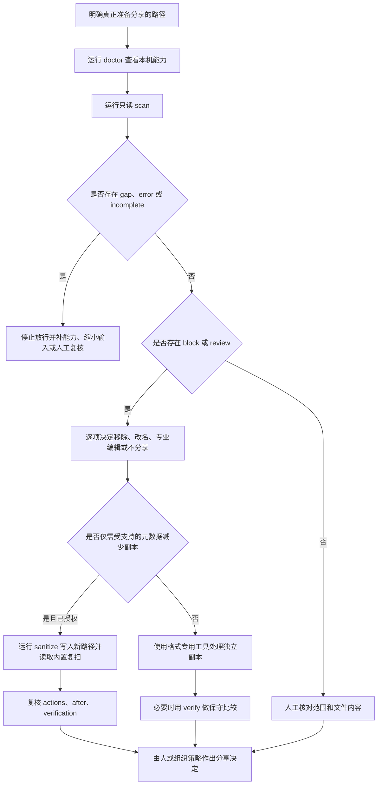

# ShareSafe v0.1 中文使用手册

本文面向需要在文件、目录、压缩包或发布制品离开本机前进行隐私审计的个人、团队、自动化维护者和 Codex 用户。手册对应 ShareSafe `0.1.x` 的公开行为；具体格式能力以 [支持矩阵](../SUPPORT_MATRIX.md) 为准，安全边界以 [威胁模型](../THREAT_MODEL.md) 为准。

> [!IMPORTANT]
> ShareSafe 能提供的最强肯定结论是“在已完成的检查范围内，没有发现达到相应规则或阈值的项目”。`no_findings` 不代表文件已经匿名、合规、无恶意内容或获准发布。

## 目录

1. [先选择使用方式](#1-先选择使用方式)
2. [能力范围与使用前提](#2-能力范围与使用前提)
3. [安装与首次验收](#3-安装与首次验收)
4. [标准分享前流程](#4-标准分享前流程)
5. [命令总览](#5-命令总览)
6. [只读扫描：scan](#6-只读扫描scan)
7. [理解报告、结论与退出码](#7-理解报告结论与退出码)
8. [创建元数据减少副本：sanitize](#8-创建元数据减少副本sanitize)
9. [比较两个独立副本：verify](#9-比较两个独立副本verify)
10. [不同材料的推荐流程](#10-不同材料的推荐流程)
11. [在 Codex 中使用 ShareSafe Skill](#11-在-codex-中使用-sharesafe-skill)
12. [接入脚本和 CI](#12-接入脚本和-ci)
13. [资源限制与大型输入](#13-资源限制与大型输入)
14. [常见问题与故障排查](#14-常见问题与故障排查)
15. [更新、卸载与分享前检查表](#15-更新卸载与分享前检查表)

## 1. 先选择使用方式

ShareSafe 提供两个入口，底层使用同一套确定性 Python 实现。

| 入口 | 适合谁 | 是否需要安装 wheel | 主要特点 |
|---|---|---:|---|
| `sharesafe` CLI | 终端用户、脚本、CI、开发者 | 是 | 参数明确、JSON 稳定、便于自动化 |
| Codex Skill | 希望用自然语言发起审计的 Codex 用户 | 否 | Skill 负责选择谨慎流程；内置脚本负责真正扫描 |

两种入口不应产生两套判断逻辑。Codex Skill 不在对话中重新实现正则表达式，也不把文件正文交给模型判断；它调用 `scripts/run_sharesafe.py` 中的本地扫描器，然后只解释已经遮罩的发现和覆盖缺口。

如果目标是 CI 或批量流程，优先使用 CLI。如果目标是临时检查一个待分享目录，并希望有人协助解释结果，可以使用 Skill。

## 2. 能力范围与使用前提

### 2.1 ShareSafe 能做什么

- 扫描普通文本、源码、配置和日志中的高置信个人信息、凭据及身份路径模式。
- 检查文件名、目录名、ZIP 成员名、压缩包评论和部分文件元数据。
- 对 `.docx`、`.xlsx`、`.pptx` 的 OOXML 包结构进行受限解析，识别属性、批注、修订、备注、隐藏内容、外部关系、宏、签名和嵌入对象等信号。
- 在资源上限内递归检查 ZIP、wheel、JAR、EPUB 等 ZIP 容器。
- 检查 PDF 的部分元数据和结构；安装 `pypdf` 后增加可提取页面文本的检查。
- 检查 JPEG、PNG 的部分元数据；安装 Pillow 后增加受支持图片格式的元数据能力。
- 把未支持、加密、损坏、解析失败或达到资源限制的内容明确记录为覆盖缺口。
- 对受支持的 OOXML、JPEG 和 PNG 创建新的元数据减少副本，并立即复扫。

### 2.2 ShareSafe 不做什么

- 不做恶意软件、病毒、漏洞利用或沙箱分析。
- 不做 OCR、图片语义识别、音视频识别或隐写检测。
- 不提供完整正文涂黑、像素级遮盖或法律意义上的不可逆脱敏。
- 不执行宏、脚本、公式、链接或嵌入程序。
- 不上传输入、报告或净化副本，也不替用户作出发布决定。
- v0.1 不改写 PDF；安装 `pypdf` 只增强扫描，不增加 PDF 净化能力。

### 2.3 使用前应准备什么

1. 明确待分享边界的准确路径。不要用过大的父目录代替真正准备分享的目录。
2. 保留原件，并把任何输出放到不同、尚不存在的路径。
3. 确认输出父目录的访问权限合适；新副本会按操作系统规则从该位置获得或继承安全属性。
4. 使用 Python 3.11 或更高版本。
5. 对 PDF 或图片有更深元数据需求时，先确认可选依赖是否已安装。
6. 把报告也当作敏感材料保护。报告虽然遮罩证据，仍会包含相对文件名、结构、大小和风险类别。

## 3. 安装与首次验收

### 3.1 从 GitHub Release 安装 CLI

从 [GitHub Releases](https://github.com/motanwenzhu/sharesafe/releases) 下载同一版本的以下文件：

- `sharesafe-VERSION-py3-none-any.whl`
- `sharesafe-VERSION.tar.gz`
- `SHA256SUMS`

先核对下载件。Linux 或 macOS 可在三个文件所在目录运行：

```bash
sha256sum -c SHA256SUMS
```

Windows PowerShell 可计算两个发布包的哈希，再与 `SHA256SUMS` 对照：

```powershell
Get-FileHash .\sharesafe-0.1.0-py3-none-any.whl -Algorithm SHA256
Get-FileHash .\sharesafe-0.1.0.tar.gz -Algorithm SHA256
Get-Content .\SHA256SUMS
```

然后在独立虚拟环境安装 wheel。核心版本没有第三方运行时依赖：

```bash
# macOS / Linux
python3 -m venv .venv-sharesafe
./.venv-sharesafe/bin/python -m pip install --no-deps ./sharesafe-0.1.0-py3-none-any.whl
```

```powershell
# Windows PowerShell
py -3 -m venv .venv-sharesafe
.\.venv-sharesafe\Scripts\python.exe -m pip install --no-deps .\sharesafe-0.1.0-py3-none-any.whl
```

如需 PDF 文本和更丰富的图片元数据能力，可以在经过许可、允许访问包索引的环境中，用同一个虚拟环境的 Python 增加可选依赖：

```bash
./.venv-sharesafe/bin/python -m pip install "pypdf>=5" "Pillow>=10"
```

Windows 使用 `.\.venv-sharesafe\Scripts\python.exe` 替换上面的解释器路径。

安装可选依赖不会增加 OCR、PDF 改写或所有图片格式的完整支持。

### 3.2 从源码安装 CLI

```bash
git clone https://github.com/motanwenzhu/sharesafe.git
cd sharesafe
python -m venv .venv
```

仅安装核心：

```bash
python -m pip install .
```

安装全部可选格式能力：

```bash
python -m pip install ".[full]"
```

用于参与开发：

```bash
python -m pip install -e ".[full,dev]"
```

如果未激活虚拟环境，请始终使用该环境中的 Python：

```bash
./.venv/bin/python -m sharesafe --version
```

Windows 对应命令为：

```powershell
.\.venv\Scripts\python.exe -m sharesafe --version
```

### 3.3 不安装 wheel，直接运行 Skill 内置 CLI

克隆仓库或安装 Skill 后，可以直接使用随 Skill 分发的入口：

```bash
python skills/sharesafe/scripts/run_sharesafe.py doctor --json
python skills/sharesafe/scripts/run_sharesafe.py scan ./to-share --json
```

该入口优先加载同一 Skill 目录内的实现，适合 Codex 和仓库内复现。只有需要全局的 `sharesafe` 命令时才必须安装 wheel。

### 3.4 首次验收

按顺序运行：

```bash
sharesafe --version
sharesafe doctor --json
sharesafe self-test --json
sharesafe formats --json
sharesafe rules --json
```

应重点确认：

- `doctor.status` 为 `ready`；
- `doctor.offline` 为 `true`，`telemetry` 为 `false`；
- Python 版本不低于 3.11；
- `self-test.passed` 为 `true`；
- `doctor.optional` 中缺少的能力与你将扫描的格式无冲突。

`self-test` 只创建临时的合成数据，检查规则命中、证据遮罩、临时路径隐藏和 HMAC 内容令牌，不会授权扫描其他文件。

## 4. 标准分享前流程



这里有三个不能跳过的判断：

1. **范围是否正确。** 扫错目录时，漂亮的结果没有意义。
2. **覆盖是否完整。** `incomplete` 比发现数量更优先。
3. **结果是否经过人工策略。** ShareSafe 输出证据，不输出发布许可。

## 5. 命令总览

| 命令 | 是否写入输入 | 主要用途 | JSON schema |
|---|---:|---|---|
| `doctor` | 否 | 查看 Python、离线属性和可选依赖 | `sharesafe.doctor/v1` |
| `formats` | 否 | 查看当前格式能力摘要 | `sharesafe.formats/v1` |
| `rules` | 否 | 查看稳定规则族 | `sharesafe.rules/v1` |
| `self-test` | 否 | 用合成数据检查安装和遮罩不变量 | `sharesafe.self-test/v1` |
| `scan` | 否 | 扫描一个或多个文件/目录 | `sharesafe.report/v1` |
| `sanitize` | 创建新副本 | 进行允许列表内的元数据变换并复扫 | `sharesafe.sanitize/v1` |
| `verify` | 否 | 重新扫描并保守比较原件与另行准备的副本 | `sharesafe.verify/v1` |

查看当前版本的准确参数：

```bash
sharesafe --help
sharesafe scan --help
sharesafe sanitize --help
sharesafe verify --help
```

## 6. 只读扫描：`scan`

### 6.1 最小命令

```bash
sharesafe scan ./待分享目录 --json
```

扫描多个明确输入时，每个路径都作为独立参数传入：

```bash
sharesafe scan ./release/app.zip ./release/README.txt --json
```

路径中有空格时必须引用：

```powershell
sharesafe scan "C:\Release Candidate\bundle" --json
```

ShareSafe 会递归扫描选中的目录，但不会自动把同级目录加入范围，也不会跟随符号链接或 Windows reparse point。

### 6.2 保存 JSON 报告

```bash
sharesafe scan ./release --json --report ./reports/release-audit.json
```

`--report` 有意采用“只创建、不覆盖”语义：

- 报告路径必须尚不存在；
- 不能与被扫描文件冲突；
- 不能位于正在扫描的目录内部；
- 写入采用临时文件、刷新和原子提交；
- 遇到竞争产生的同名文件时拒绝覆盖。

不带 `--json` 时，终端显示面向人的摘要；只要指定 `--report`，保存的文件仍是 JSON。自动化应使用 `--json` 并解析字段，不应解析终端文本。

### 6.3 设置失败阈值

```bash
sharesafe scan ./release --json --fail-on medium
```

可选值从低到高为：

```text
info < low < medium < high < critical
```

默认值是 `high`。`never` 表示普通发现不改变退出码，但它不会压过覆盖失败：只要有缺口或错误，仍然退出 `2`。

报告结论和进程退出码是两个维度：

- 一个只有 `medium` 发现的报告，结论仍是 `review`；默认 `--fail-on high` 时退出码可以是 `0`。
- 一个包含 `high` 发现的报告，结论是 `block`；`--fail-on never` 时退出码可以是 `0`。
- 任何相关缺口都会使结论为 `incomplete`、退出码为 `2`，不受 `--fail-on` 降级。

因此 CI 不能只检查退出码；必须同时检查 schema、`summary.verdict`、`summary.gaps`、`summary.errors` 和工件覆盖。

### 6.4 控制公开的资源参数

```bash
sharesafe scan ./release \
  --max-file-size 100MiB \
  --max-archive-depth 4 \
  --max-archive-entries 3000 \
  --max-findings-per-artifact 500 \
  --max-findings-total 5000 \
  --json
```

`--max-file-size` 只接受正整数和可选单位：`B`、`KB`、`KiB`、`MB`、`MiB`、`GB`、`GiB`。不接受小数。增大限制会增加处理不可信输入的内存或时间成本；达到限制应被解决或复核，不能仅靠调高数值隐藏缺口。

`--max-archive-depth` 的允许范围是 0 到 20。其他三个数量参数必须大于 0。

### 6.5 禁用可选解析器

```bash
sharesafe scan ./release --no-optional-tools --json
```

这适合复现“仅核心能力”或减少第三方解析面的测试。若当前输入依赖 Pillow 或 `pypdf`，对应能力会明确成为覆盖缺口。

## 7. 理解报告、结论与退出码

### 7.1 扫描报告的主要字段

`sharesafe.report/v1` 包含：

| 字段 | 含义 | 使用要点 |
|---|---|---|
| `tool` | 工具名称和版本 | 用于记录产生报告的版本 |
| `run` | 运行 ID、时间、离线状态、模式和实际限制 | 不要依赖时间字段作工件身份 |
| `summary` | 结论、工件数、各严重级别数量、gap/error 数 | 适合第一层决策，但不能代替明细 |
| `artifacts` | 相对展示路径、媒体类型、大小、状态、覆盖和临时内容令牌 | 展示路径仍可能敏感 |
| `findings` | 规则、类别、严重性、置信度、位置、遮罩证据、建议 | 不要尝试反向恢复证据 |
| `gaps` | 未完成的能力及原因 | 即使 findings 为空也不能忽略 |
| `errors` | 不含敏感路径的结构化失败 | 非空时不能产生放行结论 |
| `dependencies` | 本次相关的可选解析器状态 | 用来解释依赖造成的覆盖差异 |

一个合成的最小摘要示例：

```json
{
  "schema": "sharesafe.report/v1",
  "summary": {
    "verdict": "review",
    "artifacts_total": 12,
    "artifacts_complete": 12,
    "artifacts_partial": 0,
    "findings": {
      "info": 0,
      "low": 1,
      "medium": 2,
      "high": 0,
      "critical": 0
    },
    "gaps": 0,
    "errors": 0
  }
}
```

### 7.2 结论优先级

```text
存在 gap、error 或 partial 工件  -> incomplete
否则存在 high/critical 发现      -> block
否则存在任意发现                 -> review
否则                             -> no_findings
```

| 结论 | 正确理解 | 下一步 |
|---|---|---|
| `no_findings` | 已完成能力内没有规则命中 | 仍要核对范围并人工检查 |
| `review` | 有低/中等级或其他需判断项目 | 阅读规则、位置和建议，逐项决定 |
| `block` | 至少一个高/严重级别风险 | 不按原样分享 |
| `incomplete` | 至少一个相关检查未完成 | 先解决依赖、格式、加密、损坏或资源问题 |

### 7.3 每个工件的覆盖

工件对以下能力分别标记 `complete`、`partial`、`unsupported` 或 `not_applicable`：

- `text`
- `metadata`
- `hidden_content`
- `embedded_objects`
- `ocr`

`not_applicable` 必须表示该能力确实不适用，不能用来代替“不支持”。`complete` 只表示 v0.1 声明的、当前已安装能力范围内完成，不表示所有潜在隐私风险均被覆盖。

### 7.4 退出码

| 退出码 | 含义 | 自动化动作 |
|---:|---|---|
| `0` | 操作完成，没有发现达到配置阈值 | 继续解析 JSON 和组织策略，不直接发布 |
| `1` | 发现达到阈值，或验证未通过 | 阻断并复核 |
| `2` | 覆盖不完整 | 阻断；补能力或人工处理 |
| `3` | 参数无效或请求的写操作不安全 | 修正命令或路径，不重试覆盖 |
| `4` | 文件系统或内部失败 | 停止；没有可信结论 |

### 7.5 报告卫生

- 只展示规则 ID、类别、严重性、相对位置、已经遮罩的证据和建议。
- 不把报告字符串当作 HTML、Markdown 链接、shell 命令或待执行路径。
- 不重新读取命中位置的源字节来“验证”遮罩证据。
- 如果报告意外出现裸敏感值或绝对扫描根路径，停止消费该报告，只报告“报告卫生失败”，并用纯合成数据构造最小复现。
- 不默认上传报告。遮罩后的报告仍是受保护的操作记录。

## 8. 创建元数据减少副本：`sanitize`

### 8.1 什么时候使用

仅当你明确需要一个新的分享副本，并且问题属于 v0.1 的元数据允许列表时使用。正文、像素、Office 批注/修订/备注、宏、嵌入对象或 PDF 信息需要格式专用工具和人工检查。

### 8.2 命令

```bash
sharesafe sanitize ./original --out ./release-copy --json \
  --report ./reports/release-copy-sanitize.json
```

运行前必须确认：

- `./original` 是准确输入；
- `./release-copy` 与输入不同且尚不存在；
- 输出不在输入目录内部；
- 报告路径尚不存在，也不在输入或输出树内部；
- 你已授权创建这个副本；
- 输出父目录具备合适的访问控制。

ShareSafe 会拒绝覆盖已有目标、输入等于输出、输出嵌套在输入中、符号链接/reparse point、Windows alternate data stream 路径和其他危险关系。

### 8.3 v0.1 实际会改变什么

| 格式 | 允许的变换 | 重要保留项 |
|---|---|---|
| OOXML | 删除允许列表内的核心/应用/自定义属性，清理相关引用，归一化 ZIP 条目元数据 | 正文、批注、修订、备注、隐藏内容、宏和嵌入对象不自动删除 |
| PNG | 删除 `tEXt`、`zTXt`、`iTXt`、`tIME`；在方向安全时删除 `eXIf` | 像素不变；方向不确定时保留相关 EXIF 并报告不完整 |
| JPEG | 删除 COM、APP13、XMP；在方向安全时删除 EXIF | 编码图像数据不变；方向不确定时保留 EXIF 并报告不完整 |
| PDF | 不改写 | 可以原样复制到目录副本，但动作是 `unsupported`，不是 PDF 净化 |
| 普通 ZIP | 不承诺重写成员 | 原样复制并报告该变换不支持 |
| 文本/其他普通文件 | 通常复制 | 正文不改写 |

完整允许列表见 [SUPPORT_MATRIX.md](../SUPPORT_MATRIX.md#exact-v01-transformation-allowlist)。

### 8.4 内部流程和结果

`sanitize` 会：

1. 用临时 HMAC 密钥扫描原件；
2. 预检源路径、文件数、总字节数、目录深度和链接；
3. 在目标父目录中创建临时 staging 区；
4. 复制文件并只执行允许列表变换；
5. 以不覆盖语义提交新文件或目录；
6. 归一化支持的平台访问/修改时间，并只保留粗粒度可执行权限类别；
7. 使用同一临时密钥扫描新副本；
8. 用本次可信 `actions` 对比前后工件、内容令牌、类型、大小和发现；
9. 返回 `before`、`after`、`actions` 和 `verification`。

动作状态需要分别解释：

| 状态 | 含义 |
|---|---|
| `applied` | 允许列表变换已应用，可进入完整性验证 |
| `not_needed` | 没有需要移除的允许列表元数据 |
| `partial` | 只应用了部分变换，验证保持不完整 |
| `skipped` | 因格式结构、签名、宏、嵌入对象、方向或限制而跳过 |
| `unsupported` | v0.1 没有该变换 |
| `failed` | 变换失败，不能当作成功副本 |

不要仅凭“目标目录已生成”判断完成。必须同时检查 `after.summary`、所有 `actions` 和 `verification`。

### 8.5 文件系统元数据边界

净化结果是发布副本，不是备份副本：

- 支持的平台会把访问/修改时间固定到 2000-01-01；
- 不保证归一化 Windows 创建时间；
- 不保证复制原有所有者、ACL、精确 mode、扩展属性或备用数据流；
- 新路径从目标父目录获得或继承访问控制属性。

如需保留完整文件系统语义，应另存原始归档，不要把 ShareSafe 输出当作备份替代品。

### 8.6 不要在 sanitize 后追加独立 verify

`sanitize` 自己包含唯一能够信任本次变换记录的前后验证。再次运行独立 `verify` 会失去内存中的可信动作清单，任何字节变化都会故意变成 `unverified`。应直接保存并审阅 `sanitize` 返回的 `verification`。

## 9. 比较两个独立副本：`verify`

```bash
sharesafe verify ./original ./prepared-copy --json \
  --report ./reports/prepared-copy-verify.json
```

`verify` 会重新扫描两边，不信任旧报告，并比较：

- 相对工件路径和数量；
- 检测到的媒体类型；
- 字节大小；
- 同一次比较中生成的临时 HMAC 内容令牌；
- 按出现次数保留的发现集合；
- 覆盖是否退化、是否引入新发现。

独立 `verify` 不拥有外部编辑器或过去 `sanitize` 的可认证变换清单。因此：

- 字节完全相同可以得到 `preserved`；
- 字节发生任何无法由当前可信动作解释的变化都会得到 `unverified`，总体为 `incomplete`；
- 发现数量减少只能作为审阅线索，不能证明修改正确或语义等价；
- 删除敏感文件、清空正文或改变格式不会因为“发现变少”而被当作改进。

这个命令适合对另行准备的副本作保守差异检查，而不是为任意第三方修改签发证明。

## 10. 不同材料的推荐流程

### 10.1 发布目录或软件包

1. 先生成真正要发布的导出目录，不把 `.git`、构建缓存和本地虚拟环境混入范围。
2. 扫描导出目录或最终 wheel/ZIP，而不是随意扫描整个个人工作区。
3. 处理敏感文件名、凭据、用户路径和归档条目元数据提示。
4. 对所有嵌套归档 gap 保持阻断。
5. 在 CI 中使用明确 `--fail-on`，并保存受保护的 JSON 工件。

如果扫描 Git 仓库本身，`.git`、`.hg` 或 `.svn` 会被视为高风险发布信号；ShareSafe 不遍历历史，并把覆盖标为不完整。这是为了阻止把版本历史意外放进分享包。

### 10.2 Word、Excel、PowerPoint

1. 运行 `doctor`，然后扫描原始 OOXML 文件。
2. 重点检查属性、批注、修订、备注、隐藏工作表/幻灯片、外部关系、宏、签名和嵌入对象。
3. 若只有受支持属性需要移除，可以对新路径运行 `sanitize`。
4. 在 Office 或可信兼容查看器中人工检查正文、视觉效果和隐藏结构。
5. 宏启用、签名或含嵌入对象的包会保守地跳过变换，不能强行归类为完成。

### 10.3 PDF

1. 安装并确认 `pypdf`，以增加可提取文本检查。
2. 扫描并审阅元数据、动作、附件、表单、批注、加密和结构缺口。
3. 对图片型页面或视觉涂黑需求使用 OCR/专业 PDF 脱敏工具。
4. 不使用 ShareSafe v0.1 宣称 PDF 已被净化。
5. 用专业工具另存副本后，可以运行 `verify` 获取保守的重新扫描差异，但字节变化仍会是 `unverified`。

### 10.4 JPEG、PNG、TIFF、WebP

1. 运行 `doctor` 确认 Pillow 状态。
2. 扫描元数据，同时人工查看像素中是否出现人脸、地址、二维码、屏幕内容或水印。
3. JPEG/PNG 可以创建允许列表内的元数据减少副本。
4. TIFF/WebP 在 v0.1 只提供受限扫描，不提供净化。
5. EXIF Orientation 不能安全处理时，ShareSafe 会保留整段 EXIF，避免改变显示方向，并报告不完整。

### 10.5 ZIP 和嵌套归档

1. 扫描最终归档文件，不要先把不可信成员解压到工作区。
2. ShareSafe 会把成员名当作虚拟标签，不把它们当作提取路径。
3. 加密、路径穿越、重复歧义、异常压缩率、过多条目、深层嵌套和不支持的压缩方法都会产生发现或缺口。
4. v0.1 不提供普通 ZIP 成员的通用净化；应重建一个人工确认的发布归档，再重新扫描。

## 11. 在 Codex 中使用 ShareSafe Skill

### 11.1 安装

推荐让 Codex 的 `$skill-installer` 从仓库路径安装：

```text
使用 $skill-installer 从下面的 GitHub 路径安装 ShareSafe：
https://github.com/motanwenzhu/sharesafe/tree/main/skills/sharesafe
```

如果需要可复现版本，把 `main` 换成发布标签，例如：

```text
https://github.com/motanwenzhu/sharesafe/tree/v0.1.0/skills/sharesafe
```

也可以把 `skills/sharesafe` 放入仓库或用户级 `.agents/skills`。Codex 会自动发现技能；未出现时重启。位置和发现规则以 [OpenAI 官方“构建技能”文档](https://learn.chatgpt.com/zh-Hans/docs/build-skills) 为准。

### 11.2 调用示例

```text
用 $sharesafe 扫描 F:\release\bundle，只解释遮罩后的发现和覆盖缺口，不创建副本。
```

```text
用 $sharesafe 先审计 ./package。如果只有受支持的元数据问题，再告诉我可以创建什么副本；没有我的明确输出路径，不要执行 sanitize。
```

```text
用 $sharesafe 检查 ./original 和 ./prepared 的差异，明确说明 standalone verify 的 unverified 边界。
```

### 11.3 Skill 应遵守的流程

1. 确认准确输入路径；写操作还要确认独立输出路径。
2. 运行内置 `doctor --json`。
3. 默认运行只读 `scan --json`。
4. 只总结遮罩发现、严重性、覆盖、gap、error 和退出码。
5. 只有用户明确授权时才创建副本；永不覆盖输入。
6. 使用 `sanitize` 自带的前后验证，不用 standalone `verify` 重新“认证”。
7. 不上传输入或报告，不执行扫描内容，不把结论扩大为发布许可。

## 12. 接入脚本和 CI

### 12.1 最低消费要求

自动化至少必须：

1. 捕获进程退出码；
2. 把 stdout 解析为 JSON；
3. 验证 `schema`；
4. 检查 `summary.verdict`；
5. 检查 `gaps`、`errors` 和 partial 工件；
6. 使用显式 `--fail-on`；
7. 对未知 schema、未知 verdict、缺字段或无效 JSON 失败关闭；
8. 保护报告，不把报告字段拼成 shell 命令。

### 12.2 PowerShell 示例

```powershell
$reportText = sharesafe scan .\release --json --fail-on high
$shareSafeExit = $LASTEXITCODE

try {
    $report = $reportText | ConvertFrom-Json
} catch {
    throw "ShareSafe 未返回可解析 JSON"
}

if ($report.schema -ne "sharesafe.report/v1") {
    throw "未知 ShareSafe schema"
}

if ($shareSafeExit -eq 2 -or $report.summary.verdict -eq "incomplete") {
    throw "ShareSafe 覆盖不完整"
}

if ($shareSafeExit -ne 0 -or $report.summary.verdict -in @("review", "block")) {
    throw "ShareSafe 结果需要人工复核"
}
```

示例故意把 `review` 也阻断；团队可以制定自己的低/中等级审批策略，但不能把 `incomplete` 降成普通警告。

### 12.3 POSIX shell 示例

```bash
set +e
sharesafe scan ./release --json --fail-on high > sharesafe-report.json
sharesafe_exit=$?
set -e

case "$sharesafe_exit" in
  0) echo "扫描命令完成；继续解析 JSON 和执行人工策略" ;;
  1) echo "发现达到阈值或验证未通过" >&2; exit 1 ;;
  2) echo "覆盖不完整" >&2; exit 2 ;;
  3) echo "参数或请求无效" >&2; exit 3 ;;
  *) echo "扫描未产生可信结论" >&2; exit 4 ;;
esac
```

这个 shell 片段只展示退出码处理，不足以作最终发布门；还必须用 JSON 工具检查 schema、verdict、gap 和 error。

### 12.4 GitHub Actions 示例

```yaml
- name: Install ShareSafe release wheel
  run: python -m pip install --no-deps ./tools/sharesafe-0.1.0-py3-none-any.whl

- name: Audit release bundle
  shell: bash
  run: |
    set +e
    sharesafe scan ./dist --json --fail-on medium --report ./sharesafe-ci-report.json
    code=$?
    set -e
    test "$code" -eq 0

- name: Upload protected audit report
  if: always()
  uses: actions/upload-artifact@043fb46d1a93c77aae656e7c1c64a875d1fc6a0a # v7.0.1
  with:
    name: sharesafe-report
    path: sharesafe-ci-report.json
```

生产 CI 应固定 action 和 ShareSafe 制品版本/摘要，并增加 JSON schema 检查。报告工件的可见范围和保留期限也应受控。

## 13. 资源限制与大型输入

v0.1 默认限制如下，实际值同时记录在报告的 `run.limits` 中：

| 限制 | 默认值 | CLI 可覆盖 |
|---|---:|---:|
| 单文件字节 | 50 MiB | `--max-file-size` |
| 扫描总文件字节 | 1 GiB | 否 |
| 文件系统条目/文件规模 | 20,000 | 否 |
| 目录深度 | 64 | 否 |
| 单工件可搜索文本 | 16 MiB | 否 |
| 单工件保留发现 | 1,000 | `--max-findings-per-artifact` |
| 全局保留发现 | 10,000 | `--max-findings-total` |
| 单个归档条目数 | 2,000 | `--max-archive-entries` |
| 单个归档成员字节 | 32 MiB | 否 |
| 全部归档展开字节 | 256 MiB | 否 |
| 压缩比 | 200:1 | 否 |
| 归档嵌套深度 | 3 | `--max-archive-depth` |
| 单个 XML 部件 | 16 MiB | 否 |
| PDF 页数 | 500 | 否 |

限制是处理不可信输入的安全边界。达到限制时会保留已发现项目，同时产生 gap 和 `incomplete`，不会把被截断的剩余内容当作未发现。

处理大型发布包时，优先拆成与你实际分享单元一致的多个输入，而不是盲目提高全部限制。

## 14. 常见问题与故障排查

| 现象 | 常见原因 | 处理方法 |
|---|---|---|
| `doctor.status` 不是 `ready` | Python 版本过低 | 使用 Python 3.11+ 的新虚拟环境 |
| `pypdf` 或 Pillow 显示 missing | 未安装对应 extra | 若当前格式需要且已获准，安装可选依赖后重跑 doctor |
| 退出码为 `2`，findings 却是 0 | 不支持、加密、损坏、解析失败或达到限制 | 阅读 `gaps`；不能解释为未发现风险 |
| 报告路径被拒绝 | 文件已存在、位于扫描树中或与输入冲突 | 选择独立、尚不存在的报告文件 |
| `sanitize` 拒绝输出 | 输出存在、与输入相同/嵌套、链接或其他危险路径 | 选择新的同级或其他受控父目录，不覆盖重试 |
| `sanitize` 已生成文件但退出 1/2 | 有残余发现、动作 skipped/partial/unsupported 或验证不完整 | 审阅 `actions`、`after` 和 `verification`，不要只看文件是否存在 |
| standalone `verify` 对已编辑副本给出 incomplete | 没有当前操作的可信变换清单 | 这是预期的保守行为；结合专业工具记录和人工复核 |
| 扫描源码仓库出现 VCS 高风险项 | `.git`/`.hg`/`.svn` 位于分享边界 | 扫描真正的导出/发布目录，不把历史元数据打包 |
| 明明是文本却显示不支持 | 编码或内容判定不可信 | 转成受支持编码的独立副本，再重新扫描和人工比较 |
| JSON 消费失败 | 混入终端说明、schema 变化或运行失败 | 使用 `--json`，保存原报告，检查 stderr 和退出码；未知 schema 失败关闭 |
| PDF 仍然 incomplete | 深层结构、图片页、加密或解析能力有限 | 使用专业 PDF/OCR 工具；ShareSafe v0.1 不承诺完整 PDF 覆盖 |

如果遇到内部错误，先运行：

```bash
sharesafe doctor --json
sharesafe self-test --json
sharesafe --version
```

报告缺陷时只提交合成最小复现，不附真实文件、真实凭据、个人路径或未审阅报告。安全问题请使用仓库的 [私密漏洞报告入口](https://github.com/motanwenzhu/sharesafe/security/advisories/new)。

## 15. 更新、卸载与分享前检查表

### 15.1 更新

1. 阅读 [CHANGELOG](../CHANGELOG.md) 和新版本 [Release](https://github.com/motanwenzhu/sharesafe/releases)。
2. 下载同一版本的 wheel、sdist 和 `SHA256SUMS`。
3. 核对摘要。
4. 在新的虚拟环境安装，而不是直接破坏当前可复现环境。
5. 运行 `doctor`、`self-test` 和一个合成/非敏感 smoke scan。
6. 更新 CI 中固定的版本与摘要。
7. 若使用 Skill，重新安装固定标签版本并确认 Codex 能发现它。

### 15.2 卸载

CLI 安装在专用虚拟环境时，退出该环境并按团队流程移除整个虚拟环境即可。共享环境中可以运行：

```bash
python -m pip uninstall sharesafe
```

Skill 可以从对应 `.agents/skills` 位置移除，或按 OpenAI 官方文档在 Codex 配置中禁用。移除前确认目标确实是 ShareSafe Skill 目录，不要递归删除宽泛的技能根目录。

### 15.3 分享前最终检查表

- [ ] 扫描的是最终准备分享的准确路径，而不是相似目录。
- [ ] `doctor` 显示当前格式所需能力可用。
- [ ] JSON schema 是预期版本。
- [ ] 没有未解决的 `incomplete`、gap、error 或 partial 工件。
- [ ] 所有 `block` 和 `review` 项都已按规则、位置和上下文复核。
- [ ] 若运行了 `sanitize`，输出路径独立，原件未变，并已检查内置复扫和验证。
- [ ] Office 批注、修订、备注、隐藏内容和宏已在格式专用工具中人工检查。
- [ ] 图片像素和扫描 PDF 页面已人工或用专业 OCR/视觉工具检查。
- [ ] 报告和副本存放在访问控制合适的位置。
- [ ] 最终发布决定来自人或组织策略，而不是仅来自退出码 `0` 或 `no_findings`。

## 延伸阅读

- [设计方案与各部分流程](design-and-workflows.zh-CN.md)
- [v0.1 支持矩阵](../SUPPORT_MATRIX.md)
- [威胁模型](../THREAT_MODEL.md)
- [安全政策](../SECURITY.md)
- [JSON 报告消费契约](../skills/sharesafe/references/report-contract.md)
- [Skill 工作流](../skills/sharesafe/references/workflow.md)
- [OpenAI 官方“构建技能”文档](https://learn.chatgpt.com/zh-Hans/docs/build-skills)
