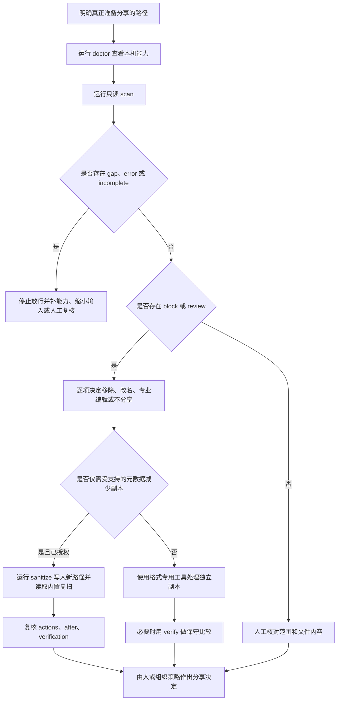

# ShareSafe v0.3 中文使用手册

本文面向需要在文件、目录、压缩包或分享制品离开本机前进行隐私审计的个人、团队、自动化维护者和 Codex 用户。手册以当前本地 v0.3 实现为准，包括 `check`/policy、`doctor --deep`、`rules --detail`、变换 receipt、报告卫生，以及 `prepare plan/inspect/approve/apply/verify` 完整流程。具体格式能力以 [支持矩阵](../SUPPORT_MATRIX.md) 为准，安全边界以 [威胁模型](../THREAT_MODEL.md) 为准。

> [!IMPORTANT]
> ShareSafe 能提供的最强肯定结论是“在已完成的检查范围内，没有发现达到相应规则或阈值的项目”。`no_findings` 不代表文件已经匿名、合规、无恶意内容或获准发布。

> [!NOTE]
> 当前包版本为 `0.3.0`，但版本号不能代替功能验收。在脚本或 CI 采用前，请在目标环境运行 `--help`、`doctor --deep --json`、`self-test --json` 和一个仅含合成数据的 smoke test。公开发布状态和制品摘要以 GitHub Releases 为准。

## 目录

1. [先选择使用方式](#1-先选择使用方式)
2. [能力范围与使用前提](#2-能力范围与使用前提)
3. [安装与首次验收](#3-安装与首次验收)
4. [标准分享前流程](#4-标准分享前流程)
5. [命令总览](#5-命令总览)
6. [只读扫描：scan](#6-只读扫描scan)
7. [理解报告、结论与退出码](#7-理解报告结论与退出码)
8. [创建元数据减少副本：sanitize](#8-创建元数据减少副本sanitize)
9. [比较两个独立副本：verify](#9-比较两个独立副本verify)
10. [不同材料的推荐流程](#10-不同材料的推荐流程)
11. [在 Codex 中使用 ShareSafe Skill](#11-在-codex-中使用-sharesafe-skill)
12. [接入脚本和 CI](#12-接入脚本和-ci)
13. [资源限制与大型输入](#13-资源限制与大型输入)
14. [常见问题与故障排查](#14-常见问题与故障排查)
15. [更新、卸载与分享前检查表](#15-更新卸载与分享前检查表)
16. [v0.2 可复现决策：policy 与 check](#16-v02-可复现决策policy-与-check)
17. [v0.2 深度能力、精确规则、receipt 与报告卫生](#17-v02-深度能力精确规则receipt-与报告卫生)
18. [v0.3 可验证分享包流程](#18-v03-可验证分享包流程)
19. [数据分级、保管与流转](#19-数据分级保管与流转)

## 1. 先选择使用方式

ShareSafe 提供两个入口，底层使用同一套确定性 Python 实现。

| 入口 | 适合谁 | 是否需要安装 wheel | 主要特点 |
|---|---|---:|---|
| `sharesafe` CLI | 终端用户、脚本、CI、开发者 | 是 | 参数明确、JSON 稳定、便于自动化 |
| Codex Skill | 希望用自然语言发起审计的 Codex 用户 | 否 | Skill 负责选择谨慎流程；内置脚本负责真正扫描 |

两种入口不应产生两套判断逻辑。Codex Skill 不在对话中重新实现正则表达式，也不把文件正文交给模型判断；它调用 `scripts/run_sharesafe.py` 中的本地扫描器，然后只解释已经遮罩的发现和覆盖缺口。

如果目标是 CI 或批量流程，优先使用 CLI。如果目标是临时检查一个待分享目录，并希望有人协助解释结果，可以使用 Skill。

## 2. 能力范围与使用前提

### 2.1 ShareSafe 能做什么

- 扫描普通文本、源码、配置和日志中的高置信个人信息、凭据及身份路径模式。
- 检查文件名、目录名、ZIP 成员名、压缩包评论和部分文件元数据。
- 对 `.docx`、`.xlsx`、`.pptx` 的 OOXML 包结构进行受限解析，识别属性、批注、修订、备注、隐藏内容、外部关系、宏、签名和嵌入对象等信号。
- 在资源上限内递归检查 ZIP、wheel、JAR、EPUB 等 ZIP 容器。
- 检查 PDF 的部分元数据和结构；安装 `pypdf` 后增加可提取页面文本的检查。
- 检查 JPEG、PNG 的部分元数据；安装 Pillow 后增加受支持图片格式的元数据能力。
- 把未支持、加密、损坏、解析失败或达到资源限制的内容明确记录为覆盖缺口。
- 对受支持的 OOXML、JPEG 和 PNG 创建新的元数据减少副本，并立即复扫。
- 通过覆盖全部源文件的显式动作计划、独立审阅与批准，构建新的可验证分享目录。

### 2.2 ShareSafe 不做什么

- 不做恶意软件、病毒、漏洞利用或沙箱分析。
- 不做 OCR、图片语义识别、音视频识别或隐写检测。
- 不提供完整正文涂黑、像素级遮盖或法律意义上的不可逆脱敏。
- 不执行宏、脚本、公式、链接或嵌入程序。
- 不上传输入、报告或净化副本，也不替用户作出发布决定。
- 不改写 PDF；安装 `pypdf` 只增强扫描，不增加 PDF 净化能力。

### 2.3 使用前应准备什么

1. 明确待分享边界的准确路径。不要用过大的父目录代替真正准备分享的目录。
2. 保留原件，并把任何输出放到不同、尚不存在的路径。
3. 确认输出父目录的访问权限合适；新副本会按操作系统规则从该位置获得或继承安全属性。
4. 使用 Python 3.11 或更高版本。
5. 对 PDF 或图片有更深元数据需求时，先确认可选依赖是否已安装。
6. 把报告也当作敏感材料保护。报告虽然遮罩证据，仍会包含相对文件名、结构、大小和风险类别。

## 3. 安装与首次验收

### 3.1 从本地受信制品安装 CLI

如果团队已在本地构建或通过受控渠道交付了同一版本的 wheel、sdist 和 `SHA256SUMS`，先核对摘要，再在独立虚拟环境中安装。本手册不假定这些制品已在任何公开仓库发布。

Linux 或 macOS 可在制品所在目录运行：

```bash
sha256sum -c SHA256SUMS
```

Windows PowerShell 可计算两个本地制品的哈希，再与 `SHA256SUMS` 对照：

```powershell
Get-FileHash .\sharesafe-VERSION-py3-none-any.whl -Algorithm SHA256
Get-FileHash .\sharesafe-VERSION.tar.gz -Algorithm SHA256
Get-Content .\SHA256SUMS
```

然后在独立虚拟环境安装 wheel。核心版本没有第三方运行时依赖：

```bash
# macOS / Linux
python3 -m venv .venv-sharesafe
./.venv-sharesafe/bin/python -m pip install --no-deps ./sharesafe-VERSION-py3-none-any.whl
```

```powershell
# Windows PowerShell
py -3 -m venv .venv-sharesafe
.\.venv-sharesafe\Scripts\python.exe -m pip install --no-deps .\sharesafe-VERSION-py3-none-any.whl
```

如需 PDF 文本和更丰富的图片元数据能力，可以在经过许可、允许访问包索引的环境中，用同一个虚拟环境的 Python 增加可选依赖：

```bash
./.venv-sharesafe/bin/python -m pip install "pypdf>=5" "Pillow>=10"
```

Windows 使用 `.\.venv-sharesafe\Scripts\python.exe` 替换上面的解释器路径。

安装可选依赖不会增加 OCR、PDF 改写或所有图片格式的完整支持。

### 3.2 从源码安装 CLI

```bash
git clone https://github.com/motanwenzhu/sharesafe.git
cd sharesafe
python -m venv .venv
```

仅安装核心：

```bash
python -m pip install .
```

安装全部可选格式能力：

```bash
python -m pip install ".[full]"
```

用于参与开发：

```bash
python -m pip install -e ".[full,dev]"
```

如果未激活虚拟环境，请始终使用该环境中的 Python：

```bash
./.venv/bin/python -m sharesafe --version
```

Windows 对应命令为：

```powershell
.\.venv\Scripts\python.exe -m sharesafe --version
```

### 3.3 不安装 wheel，直接运行 Skill 内置 CLI

克隆仓库或安装 Skill 后，可以直接使用随 Skill 分发的入口：

```bash
python skills/sharesafe/scripts/run_sharesafe.py doctor --json
python skills/sharesafe/scripts/run_sharesafe.py scan ./to-share --json
```

该入口优先加载同一 Skill 目录内的实现，适合 Codex 和仓库内复现。只有需要全局的 `sharesafe` 命令时才必须安装 wheel。

### 3.4 首次验收

按顺序运行：

```bash
sharesafe --version
sharesafe doctor --json
sharesafe self-test --json
sharesafe formats --json
sharesafe rules --json
```

应重点确认：

- `doctor.status` 为 `ready`；
- `doctor.offline` 为 `true`，`telemetry` 为 `false`；
- Python 版本不低于 3.11；
- `self-test.passed` 为 `true`；
- `doctor.optional` 中缺少的能力与你将扫描的格式无冲突。

`self-test` 只创建临时的合成数据，检查规则命中、证据遮罩、临时路径隐藏和 HMAC 内容令牌，不会授权扫描其他文件。

## 4. 标准分享前流程



这里有三个不能跳过的判断：

1. **范围是否正确。** 扫错目录时，漂亮的结果没有意义。
2. **覆盖是否完整。** `incomplete` 比发现数量更优先。
3. **结果是否经过人工策略。** ShareSafe 输出证据，不输出发布许可。

重复或 CI 流程可把图中的一次性 `scan` 替换为 `check`，从而同时保存 effective policy、ruleset version 和实际退出决策。对“从混杂工作区构建新分享边界”的任务，应进入 `prepare plan -> inspect -> approve -> apply -> verify`，而不是用默认 ignore 让原目录看起来已检查完整。

## 5. 命令总览

| 命令 | 是否写入输入 | 主要用途 | JSON schema |
|---|---:|---|---|
| `doctor` | 否 | 查看 Python、离线属性和可选依赖 | `sharesafe.doctor/v1` |
| `formats` | 否 | 查看当前格式能力摘要 | `sharesafe.formats/v1` |
| `rules` | 否 | 查看稳定规则族 | `sharesafe.rules/v1` |
| `self-test` | 否 | 用合成数据检查安装和遮罩不变量 | `sharesafe.self-test/v1` |
| `scan` | 否 | 扫描一个或多个文件/目录 | `sharesafe.report/v1` |
| `policy init/validate/show` | `init` 只创建新文件 | 创建、严格验证或显示本地策略 | `sharesafe.policy-*/v1` / `sharesafe.policy/v1` |
| `check` | 否 | 扫描并将完整有效策略、规则集与退出决策固定到 wrapper | `sharesafe.check/v1` |
| `sanitize` | 创建新副本 | 进行允许列表内的元数据变换并复扫 | `sharesafe.sanitize/v1` |
| `verify` | 否 | 重新扫描并保守比较原件与另行准备的副本 | `sharesafe.verify/v1` |
| `report show/diff/share-summary` | 否 | 本地展示、跨运行结构差异或生成最小化分享摘要 | 对应 `sharesafe.report-*/v1` 派生视图 |
| `prepare plan/inspect/approve/apply/verify` | `plan`/`approve`/`apply` 会创建新本地工件 | 构建精确分享边界 | `sharesafe.prepare-*/v1` |

查看当前版本的准确参数：

```bash
sharesafe --help
sharesafe check --help
sharesafe policy --help
sharesafe scan --help
sharesafe sanitize --help
sharesafe verify --help
sharesafe report --help
sharesafe prepare --help
```

## 6. 只读扫描：`scan`

### 6.1 最小命令

```bash
sharesafe scan ./待分享目录 --json
```

扫描多个明确输入时，每个路径都作为独立参数传入：

```bash
sharesafe scan ./release/app.zip ./release/README.txt --json
```

路径中有空格时必须引用：

```powershell
sharesafe scan "C:\Release Candidate\bundle" --json
```

ShareSafe 会递归扫描选中的目录，但不会自动把同级目录加入范围，也不会跟随符号链接或 Windows reparse point。

### 6.2 保存 JSON 报告

```bash
sharesafe scan ./release --json --report ./reports/release-audit.json
```

`--report` 有意采用“只创建、不覆盖”语义：

- 报告路径必须尚不存在；
- 不能与被扫描文件冲突；
- 不能位于正在扫描的目录内部；
- 写入采用临时文件、刷新和原子提交；
- 遇到竞争产生的同名文件时拒绝覆盖。

不带 `--json` 时，终端显示面向人的摘要；只要指定 `--report`，保存的文件仍是 JSON。自动化应使用 `--json` 并解析字段，不应解析终端文本。

### 6.3 设置失败阈值

```bash
sharesafe scan ./release --json --fail-on medium
```

可选值从低到高为：

```text
info < low < medium < high < critical
```

默认值是 `high`。`never` 表示普通发现不改变退出码，但它不会压过覆盖失败：只要有缺口或错误，仍然退出 `2`。

报告结论和进程退出码是两个维度：

- 一个只有 `medium` 发现的报告，结论仍是 `review`；默认 `--fail-on high` 时退出码可以是 `0`。
- 一个包含 `high` 发现的报告，结论是 `block`；`--fail-on never` 时退出码可以是 `0`。
- 任何相关缺口都会使结论为 `incomplete`、退出码为 `2`，不受 `--fail-on` 降级。

因此 CI 不能只检查退出码；必须同时检查 schema、`summary.verdict`、`summary.gaps`、`summary.errors` 和工件覆盖。

### 6.4 控制公开的资源参数

```bash
sharesafe scan ./release \
  --max-file-size 100MiB \
  --max-archive-depth 4 \
  --max-archive-entries 3000 \
  --max-findings-per-artifact 500 \
  --max-findings-total 5000 \
  --json
```

`--max-file-size` 只接受正整数和可选单位：`B`、`KB`、`KiB`、`MB`、`MiB`、`GB`、`GiB`。不接受小数。增大限制会增加处理不可信输入的内存或时间成本；达到限制应被解决或复核，不能仅靠调高数值隐藏缺口。

`--max-archive-depth` 的允许范围是 0 到 20。其他三个数量参数必须大于 0。

### 6.5 禁用可选解析器

```bash
sharesafe scan ./release --no-optional-tools --json
```

这适合复现“仅核心能力”或减少第三方解析面的测试。若当前输入依赖 Pillow 或 `pypdf`，对应能力会明确成为覆盖缺口。

## 7. 理解报告、结论与退出码

### 7.1 扫描报告的主要字段

`sharesafe.report/v1` 包含：

| 字段 | 含义 | 使用要点 |
|---|---|---|
| `tool` | 工具名称和版本 | 用于记录产生报告的版本 |
| `run` | 运行 ID、时间、离线状态、模式和实际限制 | 不要依赖时间字段作工件身份 |
| `summary` | 结论、工件数、各严重级别数量、gap/error 数 | 适合第一层决策，但不能代替明细 |
| `artifacts` | 相对展示路径、媒体类型、大小、状态、覆盖和临时内容令牌 | 展示路径仍可能敏感 |
| `findings` | 规则、类别、严重性、置信度、位置、遮罩证据、建议 | 不要尝试反向恢复证据 |
| `gaps` | 未完成的能力及原因 | 即使 findings 为空也不能忽略 |
| `errors` | 不含敏感路径的结构化失败 | 非空时不能产生放行结论 |
| `dependencies` | 本次相关的可选解析器状态 | 用来解释依赖造成的覆盖差异 |

一个合成的最小摘要示例：

```json
{
  "schema": "sharesafe.report/v1",
  "summary": {
    "verdict": "review",
    "artifacts_total": 12,
    "artifacts_complete": 12,
    "artifacts_partial": 0,
    "findings": {
      "info": 0,
      "low": 1,
      "medium": 2,
      "high": 0,
      "critical": 0
    },
    "gaps": 0,
    "errors": 0
  }
}
```

### 7.2 结论优先级

```text
存在 gap、error 或 partial 工件  -> incomplete
否则存在 high/critical 发现      -> block
否则存在任意发现                 -> review
否则                             -> no_findings
```

| 结论 | 正确理解 | 下一步 |
|---|---|---|
| `no_findings` | 已完成能力内没有规则命中 | 仍要核对范围并人工检查 |
| `review` | 有低/中等级或其他需判断项目 | 阅读规则、位置和建议，逐项决定 |
| `block` | 至少一个高/严重级别风险 | 不按原样分享 |
| `incomplete` | 至少一个相关检查未完成 | 先解决依赖、格式、加密、损坏或资源问题 |

### 7.3 每个工件的覆盖

工件对以下能力分别标记 `complete`、`partial`、`unsupported` 或 `not_applicable`：

- `text`
- `metadata`
- `hidden_content`
- `embedded_objects`
- `ocr`

`not_applicable` 必须表示该能力确实不适用，不能用来代替“不支持”。`complete` 只表示当前声明的、已安装能力范围内完成，不表示所有潜在隐私风险均被覆盖。

### 7.4 退出码

| 退出码 | 含义 | 自动化动作 |
|---:|---|---|
| `0` | 操作完成，没有发现达到配置阈值 | 继续解析 JSON 和组织策略，不直接发布 |
| `1` | 发现达到阈值，或验证未通过 | 阻断并复核 |
| `2` | 覆盖不完整 | 阻断；补能力或人工处理 |
| `3` | 参数无效或请求的写操作不安全 | 修正命令或路径，不重试覆盖 |
| `4` | 文件系统或内部失败 | 停止；没有可信结论 |

### 7.5 报告卫生

- 只展示规则 ID、类别、严重性、相对位置、已经遮罩的证据和建议。
- 不把报告字符串当作 HTML、Markdown 链接、shell 命令或待执行路径。
- 不重新读取命中位置的源字节来“验证”遮罩证据。
- 如果报告意外出现裸敏感值或绝对扫描根路径，停止消费该报告，只报告“报告卫生失败”，并用纯合成数据构造最小复现。
- 不默认上传报告。遮罩后的报告仍是受保护的操作记录。

## 8. 创建元数据减少副本：`sanitize`

### 8.1 什么时候使用

仅当你明确需要一个新的分享副本，并且问题属于当前元数据允许列表时使用。正文、像素、Office 批注/修订/备注、宏、嵌入对象或 PDF 信息需要格式专用工具和人工检查。

### 8.2 命令

```bash
sharesafe sanitize ./original --out ./release-copy --json \
  --report ./reports/release-copy-sanitize.json
```

运行前必须确认：

- `./original` 是准确输入；
- `./release-copy` 与输入不同且尚不存在；
- 输出不在输入目录内部；
- 报告路径尚不存在，也不在输入或输出树内部；
- 你已授权创建这个副本；
- 输出父目录具备合适的访问控制。

ShareSafe 会拒绝覆盖已有目标、输入等于输出、输出嵌套在输入中、符号链接/reparse point、Windows alternate data stream 路径和其他危险关系。

### 8.3 当前版本实际会改变什么

| 格式 | 允许的变换 | 重要保留项 |
|---|---|---|
| OOXML | 删除允许列表内的核心/应用/自定义属性，清理相关引用，归一化 ZIP 条目元数据 | 正文、批注、修订、备注、隐藏内容、宏和嵌入对象不自动删除 |
| PNG | 删除 `tEXt`、`zTXt`、`iTXt`、`tIME`；在方向安全时删除 `eXIf` | 像素不变；方向不确定时保留相关 EXIF 并报告不完整 |
| JPEG | 删除 COM、APP13、XMP；在方向安全时删除 EXIF | 编码图像数据不变；方向不确定时保留 EXIF 并报告不完整 |
| PDF | 不改写 | 可以原样复制到目录副本，但动作是 `unsupported`，不是 PDF 净化 |
| 普通 ZIP | 不承诺重写成员 | 原样复制并报告该变换不支持 |
| 文本/其他普通文件 | 通常复制 | 正文不改写 |

完整允许列表见 [SUPPORT_MATRIX.md](../SUPPORT_MATRIX.md#exact-v01-transformation-allowlist)。

### 8.4 内部流程和结果

`sanitize` 会：

1. 用临时 HMAC 密钥扫描原件；
2. 预检源路径、文件数、总字节数、目录深度和链接；
3. 在目标父目录中创建临时 staging 区；
4. 复制文件并只执行允许列表变换；
5. 以不覆盖语义提交新文件或目录；
6. 归一化支持的平台访问/修改时间，并只保留粗粒度可执行权限类别；
7. 使用同一临时密钥扫描新副本；
8. 用本次可信 `actions` 对比前后工件、内容令牌、类型、大小和发现；
9. 返回 `before`、`after`、`actions` 和 `verification`。

动作状态需要分别解释：

| 状态 | 含义 |
|---|---|
| `applied` | 允许列表变换已应用，可进入完整性验证 |
| `not_needed` | 没有需要移除的允许列表元数据 |
| `partial` | 只应用了部分变换，验证保持不完整 |
| `skipped` | 因格式结构、签名、宏、嵌入对象、方向或限制而跳过 |
| `unsupported` | 当前版本没有该变换 |
| `failed` | 变换失败，不能当作成功副本 |

不要仅凭“目标目录已生成”判断完成。必须同时检查 `after.summary`、所有 `actions` 和 `verification`。

#### v0.2 变换 receipt 与精确字节绑定

v0.2 不再因为“路径相同 + action 名称看起来受支持”就相信一次变化。`sanitize` 进程内部会由核心签发不可从外部 JSON 重建的 `TransformReceipt`，并绑定四个快照：

1. before scan 实际读到的 token；
2. 变换器实际读到的 transform-input token；
3. 变换器实际写出的 expected-after token；
4. after scan 实际读到的 postscan token。

只有 `before == transform-input`、`expected-after == postscan`、媒体类型与动作精确匹配、路径唯一，且所有格式级 `preserved_facets` 都保持，变化才能进入 `transformed` 完整性状态。受保护的 facet 至少包括：

| 格式 | 变换中必须保持的主要表示 |
|---|---|
| OOXML | 允许列表以外的 ZIP 成员内容、成员集与关系目标 |
| PNG | 关键块、全部 IDAT、尺寸/色彩关键字段和必须保留的 Orientation |
| JPEG | SOS 后编码扫描数据、SOF 尺寸/采样信息和非删除段 |
| 原样复制 | 整文件 token、大小和媒体类型 |

保存的 `actions` 是用于审阅的遮罩记录，不是可被重新导入的信任凭据。伪造、拷贝或编辑一份外部 action JSON，不能让 standalone `verify` 信任过去的变化。任一 token/facet 不符、receipt 缺失或不受信，都必须导致 `unverified`/`incomplete`。

### 8.5 文件系统元数据边界

净化结果是发布副本，不是备份副本：

- 支持的平台会把访问/修改时间固定到 2000-01-01；
- 不保证归一化 Windows 创建时间；
- 不保证复制原有所有者、ACL、精确 mode、扩展属性或备用数据流；
- 新路径从目标父目录获得或继承访问控制属性。

如需保留完整文件系统语义，应另存原始归档，不要把 ShareSafe 输出当作备份替代品。

### 8.6 不要在 sanitize 后追加独立 verify

`sanitize` 自己包含唯一能够信任本次变换记录的前后验证。再次运行独立 `verify` 会失去内存中的可信动作清单，任何字节变化都会故意变成 `unverified`。应直接保存并审阅 `sanitize` 返回的 `verification`。

## 9. 比较两个独立副本：`verify`

```bash
sharesafe verify ./original ./prepared-copy --json \
  --report ./reports/prepared-copy-verify.json
```

`verify` 会重新扫描两边，不信任旧报告，并比较：

- 相对工件路径和数量；
- 检测到的媒体类型；
- 字节大小；
- 同一次比较中生成的临时 HMAC 内容令牌；
- 按出现次数保留的发现集合；
- 覆盖是否退化、是否引入新发现。

独立 `verify` 不拥有外部编辑器或过去 `sanitize` 的可认证变换清单。因此：

- 字节完全相同可以得到 `preserved`；
- 字节发生任何无法由当前可信动作解释的变化都会得到 `unverified`，总体为 `incomplete`；
- 发现数量减少只能作为审阅线索，不能证明修改正确或语义等价；
- 删除敏感文件、清空正文或改变格式不会因为“发现变少”而被当作改进。

这个命令适合对另行准备的副本作保守差异检查，而不是为任意第三方修改签发证明。

## 10. 不同材料的推荐流程

### 10.1 发布目录或软件包

1. 先生成真正要发布的导出目录，不把 `.git`、构建缓存和本地虚拟环境混入范围。
2. 扫描导出目录或最终 wheel/ZIP，而不是随意扫描整个个人工作区。
3. 处理敏感文件名、凭据、用户路径和归档条目元数据提示。
4. 对所有嵌套归档 gap 保持阻断。
5. 在 CI 中使用明确 `--fail-on`，并保存受保护的 JSON 工件。

如果扫描 Git 仓库本身，`.git`、`.hg` 或 `.svn` 会被视为高风险发布信号；ShareSafe 不遍历历史，并把覆盖标为不完整。这是为了阻止把版本历史意外放进分享包。

### 10.2 Word、Excel、PowerPoint

1. 运行 `doctor`，然后扫描原始 OOXML 文件。
2. 重点检查属性、批注、修订、备注、隐藏工作表/幻灯片、外部关系、宏、签名和嵌入对象。
3. 若只有受支持属性需要移除，可以对新路径运行 `sanitize`。
4. 在 Office 或可信兼容查看器中人工检查正文、视觉效果和隐藏结构。
5. 宏启用、签名或含嵌入对象的包会保守地跳过变换，不能强行归类为完成。

### 10.3 PDF

1. 安装并确认 `pypdf`，以增加可提取文本检查。
2. 扫描并审阅元数据、动作、附件、表单、批注、加密和结构缺口。
3. 对图片型页面或视觉涂黑需求使用 OCR/专业 PDF 脱敏工具。
4. 不使用 ShareSafe 宣称 PDF 已被净化。
5. 用专业工具另存副本后，可以运行 `verify` 获取保守的重新扫描差异，但字节变化仍会是 `unverified`。

### 10.4 JPEG、PNG、TIFF、WebP

1. 运行 `doctor` 确认 Pillow 状态。
2. 扫描元数据，同时人工查看像素中是否出现人脸、地址、二维码、屏幕内容或水印。
3. JPEG/PNG 可以创建允许列表内的元数据减少副本。
4. TIFF/WebP 只提供受限扫描，不提供净化。
5. EXIF Orientation 不能安全处理时，ShareSafe 会保留整段 EXIF，避免改变显示方向，并报告不完整。

### 10.5 ZIP 和嵌套归档

1. 扫描最终归档文件，不要先把不可信成员解压到工作区。
2. ShareSafe 会把成员名当作虚拟标签，不把它们当作提取路径。
3. 加密、路径穿越、重复歧义、异常压缩率、过多条目、深层嵌套和不支持的压缩方法都会产生发现或缺口。
4. 当前版本不提供普通 ZIP 成员的通用净化；应重建一个人工确认的发布归档，再重新扫描。

## 11. 在 Codex 中使用 ShareSafe Skill

### 11.1 安装

可以直接从仓库的 `skills/sharesafe` 使用 Skill：将该目录按 Codex 的 Skill 安装方式放入仓库级或用户级 Skill 目录，也可在开发仓库内直接运行 `scripts/run_sharesafe.py`。正式版本以 [GitHub Releases](https://github.com/motanwenzhu/sharesafe/releases) 中的 tag、制品和 `SHA256SUMS` 为准。安装前记录来源版本/摘要，安装后运行 Skill validator 和合成 smoke test。

Skill 位置和发现规则以当前 Codex 官方 Skill 文档为准。如果 Skill 未被发现，先检查目录名、`SKILL.md` frontmatter 和安装位置，再重启 Codex。

### 11.2 调用示例

```text
用 $sharesafe 扫描 F:\release\bundle，只解释遮罩后的发现和覆盖缺口，不创建副本。
```

```text
用 $sharesafe 先审计 ./package。如果只有受支持的元数据问题，再告诉我可以创建什么副本；没有我的明确输出路径，不要执行 sanitize。
```

```text
用 $sharesafe 检查 ./original 和 ./prepared 的差异，明确说明 standalone verify 的 unverified 边界。
```

### 11.3 Skill 应遵守的流程

1. 确认准确输入路径；写操作还要确认独立输出路径。
2. 运行内置 `doctor --json`。
3. 默认运行只读 `scan --json`。
4. 只总结遮罩发现、严重性、覆盖、gap、error 和退出码。
5. 只有用户明确授权时才创建副本；永不覆盖输入。
6. 使用 `sanitize` 自带的前后验证，不用 standalone `verify` 重新“认证”。
7. 不上传输入或报告，不执行扫描内容，不把结论扩大为发布许可。

## 12. 接入脚本和 CI

### 12.1 最低消费要求

自动化至少必须：

1. 捕获进程退出码；
2. 把 stdout 解析为 JSON；
3. 验证 `schema`；
4. 检查 `summary.verdict`；
5. 检查 `gaps`、`errors` 和 partial 工件；
6. 使用显式 `--fail-on`；
7. 对未知 schema、未知 verdict、缺字段或无效 JSON 失败关闭；
8. 保护报告，不把报告字段拼成 shell 命令。

### 12.2 PowerShell 示例

```powershell
$reportText = sharesafe scan .\release --json --fail-on high
$shareSafeExit = $LASTEXITCODE

try {
    $report = $reportText | ConvertFrom-Json
} catch {
    throw "ShareSafe 未返回可解析 JSON"
}

if ($report.schema -ne "sharesafe.report/v1") {
    throw "未知 ShareSafe schema"
}

if ($shareSafeExit -eq 2 -or $report.summary.verdict -eq "incomplete") {
    throw "ShareSafe 覆盖不完整"
}

if ($shareSafeExit -ne 0 -or $report.summary.verdict -in @("review", "block")) {
    throw "ShareSafe 结果需要人工复核"
}
```

示例故意把 `review` 也阻断；团队可以制定自己的低/中等级审批策略，但不能把 `incomplete` 降成普通警告。

### 12.3 POSIX shell 示例

```bash
set +e
sharesafe scan ./release --json --fail-on high > sharesafe-report.json
sharesafe_exit=$?
set -e

case "$sharesafe_exit" in
  0) echo "扫描命令完成；继续解析 JSON 和执行人工策略" ;;
  1) echo "发现达到阈值或验证未通过" >&2; exit 1 ;;
  2) echo "覆盖不完整" >&2; exit 2 ;;
  3) echo "参数或请求无效" >&2; exit 3 ;;
  *) echo "扫描未产生可信结论" >&2; exit 4 ;;
esac
```

这个 shell 片段只展示退出码处理，不足以作最终发布门；还必须用 JSON 工具检查 schema、verdict、gap 和 error。

### 12.4 通用 CI 作业示例

```yaml
- name: Install reviewed local ShareSafe wheel
  run: python -m pip install --no-deps ./tools/sharesafe-VERSION-py3-none-any.whl

- name: Audit bundle with recorded policy
  shell: bash
  run: |
    set +e
    sharesafe check ./dist --config ./.sharesafe.toml --json --report ./sharesafe-ci-check.json
    code=$?
    set -e
    test "$code" -eq 0
```

生产 CI 应固定 ShareSafe 制品版本/摘要和策略 digest，并增加 `sharesafe.check/v1` schema 验证。示例故意没有上传报告；如果必须保存 CI artifact，需另行授权，并限制可见范围、保留期和下载人员。

## 13. 资源限制与大型输入

当前默认限制如下，实际值同时记录在报告的 `run.limits` 中：

| 限制 | 默认值 | CLI 可覆盖 |
|---|---:|---:|
| 单文件字节 | 50 MiB | `--max-file-size` |
| 扫描总文件字节 | 1 GiB | 否 |
| 文件系统条目/文件规模 | 20,000 | 否 |
| 目录深度 | 64 | 否 |
| 单工件可搜索文本 | 16 MiB | 否 |
| 单工件保留发现 | 1,000 | `--max-findings-per-artifact` |
| 全局保留发现 | 10,000 | `--max-findings-total` |
| 单个归档条目数 | 2,000 | `--max-archive-entries` |
| 单个归档成员字节 | 32 MiB | 否 |
| 全部归档展开字节 | 256 MiB | 否 |
| 压缩比 | 200:1 | 否 |
| 归档嵌套深度 | 3 | `--max-archive-depth` |
| 单个 XML 部件 | 16 MiB | 否 |
| PDF 页数 | 500 | 否 |
| 原始名称字节 | 4 KiB | 可通过 policy 固定 |
| 展示路径字符 | 16,384 | 可通过 policy 固定 |
| 单报告字段字符 | 16,384 | 可通过 policy 固定 |
| 总 gap / error | 10,000 / 1,000 | 可通过 policy 固定 |
| 序列化 JSON 报告 | 32 MiB | 可通过 policy 固定 |

限制是处理不可信输入的安全边界。达到限制时会保留已发现项目，同时产生 gap 和 `incomplete`，不会把被截断的剩余内容当作未发现。

处理大型发布包时，优先拆成与你实际分享单元一致的多个输入，而不是盲目提高全部限制。

## 14. 常见问题与故障排查

| 现象 | 常见原因 | 处理方法 |
|---|---|---|
| `doctor.status` 不是 `ready` | Python 版本过低 | 使用 Python 3.11+ 的新虚拟环境 |
| `pypdf` 或 Pillow 显示 missing | 未安装对应 extra | 若当前格式需要且已获准，安装可选依赖后重跑 doctor |
| 退出码为 `2`，findings 却是 0 | 不支持、加密、损坏、解析失败或达到限制 | 阅读 `gaps`；不能解释为未发现风险 |
| 报告路径被拒绝 | 文件已存在、位于扫描树中或与输入冲突 | 选择独立、尚不存在的报告文件 |
| `sanitize` 拒绝输出 | 输出存在、与输入相同/嵌套、链接或其他危险路径 | 选择新的同级或其他受控父目录，不覆盖重试 |
| `sanitize` 已生成文件但退出 1/2 | 有残余发现、动作 skipped/partial/unsupported 或验证不完整 | 审阅 `actions`、`after` 和 `verification`，不要只看文件是否存在 |
| standalone `verify` 对已编辑副本给出 incomplete | 没有当前操作的可信变换清单 | 这是预期的保守行为；结合专业工具记录和人工复核 |
| 扫描源码仓库出现 VCS 高风险项 | `.git`/`.hg`/`.svn` 位于分享边界 | 扫描真正的导出/发布目录，不把历史元数据打包 |
| 明明是文本却显示不支持 | 编码或内容判定不可信 | 转成受支持编码的独立副本，再重新扫描和人工比较 |
| JSON 消费失败 | 混入终端说明、schema 变化或运行失败 | 使用 `--json`，保存原报告，检查 stderr 和退出码；未知 schema 失败关闭 |
| PDF 仍然 incomplete | 深层结构、图片页、加密或解析能力有限 | 使用专业 PDF/OCR 工具；ShareSafe 不承诺完整 PDF 覆盖 |
| `doctor` 显示 available，`--deep` 却 failed | 包存在但 import/最小合成 parser probe 不可用 | 在受控环境修复版本或依赖；不把 discovery 当可用性证明 |
| `check` 返回 `review` 但退出 `0` | finding 低于 `fail_on` 且不属于 blocking category | 按组织流程人工复核；不把 `0` 说成安全 |
| 开启 manifest 后 `check` 始终 `incomplete` | `check` 的 manifest validator 仍没有 exact inventory receipt | 这是预期失败闭合；`prepare` 的计划回执不能冒充 `check` manifest receipt |
| policy 报 unknown/duplicate/out-of-range | 字段错误、列表重复或限制超出安全边界 | 不删除检查来绕过；对照 `policy show` 生成的归一化字段修正 |
| `sanitize` 的变化变成 `unverified` | receipt 缺失/不受信、前后 token 不符或 protected facet 变化 | 不重用外部 action JSON；保留原件，对合成复现排查竞态或变换器缺陷 |
| 报告输出被卫生检查拒绝 | 字段/总大小超限、非相对路径、控制字符或疑似原始 evidence | 停止消费该报告；用合成 canary 报告缺陷，不附真实文件 |
| `prepare` 未出现在 `--help` | 当前安装版本早于 v0.3 或安装不完整 | 核对 `sharesafe --version` 和安装源；不要猜测参数 |
| `prepare apply` 报 plan/source drift | plan 后源 inventory 或内容变化 | 不强制应用旧计划；重新 plan、inspect 和 approve |
| `prepare apply` 报 private staging unavailable | 当前平台无法创建并验证当前用户专用暂存目录 | 更换受支持的本地文件系统/运行环境；不要降级成普通共享临时目录 |
| `prepare` 结果为 `reporting.detail: truncated` | 动作、问题或最终扫描明细超过报告字节预算 | 输出仍需复核；按省略计数处理为 `incomplete`，在受控环境提高预算后重跑 |
| apply 失败并提示输出可能存在 | 目标名已被保留后发生提交/竞态/验证失败 | 不分享该目录；检查随机 incomplete marker，换新输出路径并从 plan/approve 重新开始 |

如果遇到内部错误，先运行：

```bash
sharesafe doctor --json
sharesafe self-test --json
sharesafe --version
```

报告缺陷时只提交合成最小复现，不附真实文件、真实凭据、个人路径或未审阅报告。安全问题请使用仓库的 [私密漏洞报告入口](https://github.com/motanwenzhu/sharesafe/security/advisories/new)。

## 15. 更新、卸载与分享前检查表

### 15.1 更新

1. 阅读本地 [CHANGELOG](../CHANGELOG.md)、设计契约和 schema 变化。
2. 从团队已审阅的本地源构建或取得同一版本的 wheel、sdist 和 `SHA256SUMS`。
3. 核对摘要和制品内容清单。
4. 在新的虚拟环境安装，而不是直接破坏当前可复现环境。
5. 运行 `doctor`、`self-test` 和一个合成/非敏感 smoke scan。
6. 更新 CI 中固定的版本与摘要。
7. 若使用 Skill，重新安装已记录版本/摘要的本地副本，并确认 Codex 能发现它。

### 15.2 卸载

CLI 安装在专用虚拟环境时，退出该环境并按团队流程移除整个虚拟环境即可。共享环境中可以运行：

```bash
python -m pip uninstall sharesafe
```

Skill 可以从对应 `.agents/skills` 位置移除，或按 OpenAI 官方文档在 Codex 配置中禁用。移除前确认目标确实是 ShareSafe Skill 目录，不要递归删除宽泛的技能根目录。

### 15.3 分享前最终检查表

- [ ] 扫描的是最终准备分享的准确路径，而不是相似目录。
- [ ] `doctor` 显示当前格式所需能力可用。
- [ ] 对新环境已运行 `doctor --deep`，并阅读了文件系统安全能力中的 `false` 项。
- [ ] JSON schema 是预期版本。
- [ ] 若使用 `check`，已核对 policy digest、ruleset version、technical verdict、policy outcome、reason codes 和退出码。
- [ ] 没有未解决的 `incomplete`、gap、error 或 partial 工件。
- [ ] 所有 `block` 和 `review` 项都已按规则、位置和上下文复核。
- [ ] 若运行了 `sanitize`，输出路径独立，原件未变，并已检查内置复扫和验证。
- [ ] 任何 `transformed` 都是本次进程 exact receipt 验证的结果，不是从外部 action JSON 推断。
- [ ] 若使用 prepare，每个 source item 恰有一个 action，已审阅 masked inspection，批准覆盖完整 action ID 集，apply 前无 source drift，且最终输出已复扫。
- [ ] prepare 结果的 `reporting.detail` 为 `complete`，动作/问题 omitted 计数为 0，且 final scan 没有未解决 gap。
- [ ] Office 批注、修订、备注、隐藏内容和宏已在格式专用工具中人工检查。
- [ ] 图片像素和扫描 PDF 页面已人工或用专业 OCR/视觉工具检查。
- [ ] 报告和副本存放在访问控制合适的位置。
- [ ] local control plan、approval 和强 source binding 未被放入待分享边界。
- [ ] 最终发布决定来自人或组织策略，而不是仅来自退出码 `0` 或 `no_findings`。

## 16. v0.2 可复现决策：policy 与 `check`

`scan` 回答“技术扫描看到什么”；`check` 在不改动原生 `sharesafe.report/v1` 的前提下，还固定“当时用了什么有效策略，为什么得到这个进程决策”。对 CI、重复扫描和事后复核，应优先保存 `sharesafe.check/v1`。

### 16.1 创建与验证本地策略

创建一份不覆盖现有文件的默认策略：

```powershell
sharesafe policy init --out .\.sharesafe.toml --json
sharesafe policy validate --config .\.sharesafe.toml --json
sharesafe policy show --config .\.sharesafe.toml --json
```

`policy init` 的目标必须不存在。`validate` 只表示 TOML 和策略 schema 合法，不表示当前输入已检查。`show` 输出归一化有效策略和其 digest，便于确认数值单位、默认值和列表排序。

当前策略允许的顶层字段只有：

| 字段 | 用途 | 不能做什么 |
|---|---|---|
| `fail_on` | 设置哪一严重度起进程阻断 | 不改 finding severity，不压制 finding |
| `limits` | 固定输入、容器、发现和报告预算 | 不能超过 schema 的安全范围 |
| `required_capabilities` | 要求 `text`/`metadata`/`hidden_content`/`embedded_objects`/`ocr` 在相关工件上完成或不适用 | 不把 `partial`/`unsupported` 当完成 |
| `blocking_categories` | 指定一类 finding 无论 severity 都使 policy 阻断 | 不删除原报告中的该类 finding |
| `optional_tools` | 是否允许使用已安装的 Pillow / `pypdf` | 不自动安装依赖 |
| `manifest` | 声明需要一份精确输入清单 | 不仅因配置能解析就声称 manifest 已验证 |

一个最小的合成示例：

```toml
schema = "sharesafe.policy/v1"
fail_on = "medium"
required_capabilities = ["metadata", "text"]
blocking_categories = ["secret"]
optional_tools = true

[limits]
max_file_bytes = "50MiB"
max_archive_depth = 3
max_report_bytes = "32MiB"

[manifest]
enabled = false
require_exact = true
```

策略解析失败关闭：未知字段、重复列表值、超界限制、非 UTF-8、通配符/环境变量式 manifest 路径、超大策略或读取期间变化都不会产生策略决策。策略不是可执行插件：不包含任意正则、Python、shell 或动态 import。

### 16.2 合并优先级

`check` 严格按下列顺序合并，右侧优先：

```text
内置默认 < 当前工作目录 ./.sharesafe.toml < 显式 --config < 显式 CLI 参数
```

它不搜索父目录，不读取用户级全局策略，不从环境变量隐式改变决策。因此自动化应设置可预期的工作目录，并在需要时使用显式 `--config`。

### 16.3 运行 `check`

```powershell
sharesafe check .\synthetic-share --config .\.sharesafe.toml `
  --json --report .\reports\synthetic-check.json
```

CLI 可对部分常用值显式覆盖：

```powershell
sharesafe check .\synthetic-share --config .\.sharesafe.toml `
  --fail-on high --no-optional-tools --max-file-size 25MiB --json
```

`sharesafe.check/v1` 包含：

- 未改动的 `sharesafe.report/v1`；
- 完整归一化的 effective policy、`sha256:` policy digest 和 `ruleset_version`；
- `technical_verdict`，即原生扫描技术结论；
- `policy_outcome`，即 `pass`/`review`/`block`/`incomplete`；
- 与实际进程返回一致的 `exit_code`；
- 稳定 `reason_codes`，例如 `coverage_gap_present`、`severity_threshold_met` 或 `findings_below_threshold`；
- manifest 状态 `not_required`/`missing`/`complete`/`incomplete`。

`policy_outcome: pass` 只表示“当前有效策略没有要求阻断，且没有已知的覆盖不完整”；它不是“安全”、“匿名”或“可分享”。

### 16.4 `check` 退出码

| 决策 | 退出码 | 含义 |
|---|---:|---|
| `pass` | `0` | 未命中策略阻断条件；仍需人工核对范围 |
| `review` | `0` | 存在 finding，但低于阈值且不在 blocking category；不应被忽略 |
| `block` | `1` | 达到 severity 阈值或 blocking category |
| `incomplete` | `2` | gap、error、partial/unsupported coverage、缺少 required capability 或 manifest 未精确验证 |
| 参数/不安全请求 | `3` | 未产生可信 check wrapper |
| 文件系统/内部失败 | `4` | 未产生可信结论 |

`technical_verdict: block` 与 `policy_outcome: review` 可以同时出现，例如原生报告有 high finding，而显式策略设为 `fail_on = "critical"`。这不是矛盾：前者是技术分类，后者是被记录的本次策略决策。

> [!CAUTION]
> 当前 manifest 配置只有策略契约。如果 `manifest.enabled = true` 而没有精确 inventory validator 出具成功回执，`check` 必须返回 `incomplete`。不要为了获得退出码 `0` 而关掉这个约束；应等待 v0.3 的精确边界验证闭环。

## 17. v0.2 深度能力、精确规则、receipt 与报告卫生

### 17.1 `doctor --deep`

```powershell
sharesafe doctor --deep --json
```

默认 `doctor` 只做 discovery；`--deep` 会离线 import Pillow 和 `pypdf`，用内存中的最小合成 PNG/PDF 执行 probe。它不读用户文件、不安装依赖、不访问网络。应检查：

- `probe_mode` 是 `deep`；
- 相关可选依赖的 `available`、`usable`、`probe`、`version` 和 `supported_version`；
- `filesystem_safety.descriptor_identity_before_read`、`final_component_nofollow`、`parent_directory_handle_anchoring`、`exclusive_destination_creation`、`private_temporary_staging_fail_closed` 和 `private_temporary_staging_permission`；
- `status` 是否为 `ready`。

`ready` 只说明核心运行时和已安装 parser 的合成 probe 可用。例如当前平台如果报告 `parent_directory_handle_anchoring: false`，并发父目录替换仍是明示加固缺口，不应被 `status: ready` 隐藏。

### 17.2 `rules --detail --json`

```powershell
sharesafe rules --detail --json
```

精确目录为每条规则输出 `rule_id`、`category`、`default_severity`、`confidence`、`formats`、`representations`、`validator` 和 `automatic_remediation`，并记录 `ruleset_version`。这适合生成审阅清单和确认 policy 中的 category；它不包含匹配到的原始值，也不是关闭单条 detector 的接口。`automatic_remediation: true` 只表示存在某个受支持的窄变换，不表示当前文件一定能无损处理。

### 17.3 报告卫生机械门禁

在 JSON stdout 或报告文件写入前，统一卫生检查会验证：

1. 公开报告字段结构与类型；
2. evidence 模式和只允许遮罩值的字段组合；
3. 展示路径是相对、无控制字符，且不包含已知 home/UNC/绝对根形状；
4. 单字段和总 JSON 大小预算；
5. `error` 不含底层 exception 原文；
6. 嵌套在 `check`、`sanitize`、`verify` 或 `prepare-result` 中的每个 `sharesafe.report/v1` 也受同样检查。

卫生失败时应停止消费该输出，不得回读原文来“修复” evidence。如果是产品缺陷，只用合成 canary 和合成路径构造最小复现。

名称与报告预算包括 `max_name_bytes`、`max_display_path_chars`、`max_report_field_chars`、`max_gaps_total`、`max_errors_total` 和 `max_report_bytes`。达到限制不能静默丢弃：应使用固定不可逆 placeholder，保留控制用 gap/summary 空间，并把本次结果保持为 `incomplete`。

### 17.4 本地报告展示与结构差异

> [!NOTE]
> 以当前 `sharesafe report --help` 核对参数；`show`、`diff` 和 `share-summary` 都只消费已保存的遮罩报告，不读取原始输入。

```powershell
sharesafe report show .\reports\synthetic-check.json --group-by rule --min-severity medium
sharesafe report diff .\reports\older.json .\reports\newer.json --json
```

`show` 必须仅消费已遮罩报告，不去原始路径回读内容。`diff` 只能说明“同一 rule/path/location 结构仍存在”、`structure-new`、`structure-resolved` 以及 schema/ruleset/policy 变化。由于 evidence token 和 content token 默认使用 run-scoped HMAC，跨运行 diff 不能声称字节相同、敏感值相同，也不能替代本次退出码。

## 18. v0.3 可验证分享包流程

`prepare` 解决的是“如何从混杂源目录构建一个成员明确、动作逐项批准、关系可重算的新分享目录”。它不使用默认 ignore，也不会因为某个文件没出现在决策里就悄悄跳过。完整命令序列如下：

```text
sharesafe prepare plan SOURCE --decisions DECISIONS.json --out-plan PLAN.json --json
sharesafe prepare inspect PLAN.json --json
sharesafe prepare approve PLAN.json --out-approval APPROVAL.json --approve-all --json
sharesafe prepare apply PLAN.json --approval APPROVAL.json --source SOURCE --out NEW_OUTPUT_DIRECTORY --json
sharesafe prepare verify PLAN.json --source SOURCE --output NEW_OUTPUT_DIRECTORY --json
```

`DECISIONS.json`、`PLAN.json` 和 `APPROVAL.json` 都是本地控制工件，不是可分享报告。它们应放在 `SOURCE` 和最终输出之外，并按敏感文件保护。

### 18.1 先写完整决策文件

最小结构如下；示例中的文件名和内容都应替换为当前源目录的合成或真实相对路径，但每个普通文件必须恰好出现一次：

```json
{
  "schema": "sharesafe.prepare-decisions/v1",
  "classification": "local_only_do_not_share",
  "source_boundary": "<selected-source>",
  "actions": [
    {
      "source_path": "public/readme.txt",
      "target_path": "public/readme.txt",
      "action": "copy_unchanged",
      "reason_code": "explicit_include"
    },
    {
      "source_path": "draft/internal.txt",
      "target_path": null,
      "action": "omit_from_boundary",
      "reason_code": "internal_only"
    },
    {
      "source_path": "old-name.txt",
      "target_path": "renamed.txt",
      "action": "rename_in_bundle",
      "reason_code": "release_name"
    },
    {
      "source_path": "image.png",
      "target_path": "image.png",
      "action": "strip_png_metadata",
      "reason_code": "metadata_detected"
    }
  ]
}
```

顶层和 action 对象都拒绝未知字段。`reason_code` 只能使用稳定的小写代码，而不是把敏感说明或原始证据写进去。决策文件不是 ShareSafe 自动生成的忽略列表：应由用户、团队规则或上游程序明确产生。

动作含义与最低验证关系如下：

| Action | 用户意图 | 执行与验证条件 |
|---|---|---|
| `copy_unchanged` | 原路径原样纳入 | `target_path` 必须等于源相对路径；字节、媒体类型和大小一致 |
| `rename_in_bundle` | 改成另一个包内相对路径 | 字节和媒体类型不变；新旧路径无冲突，旧名不残留 |
| `omit_from_boundary` | 不进入新边界 | `target_path` 必须为 `null`；该路径及其树不能被其他 target 复活 |
| `strip_ooxml_metadata` | 只删除允许列表内 OOXML 元数据 | 媒体类型匹配、变换实际发生、receipt 和 protected facets 全部通过 |
| `strip_png_metadata` | 只删除受支持 PNG 元数据块 | 变换实际发生；像素/关键容器表示保持 |
| `strip_jpeg_metadata` | 只删除受支持 JPEG 元数据段 | 变换实际发生；编码扫描数据和受保护段保持 |
| `manual_or_external_required` | 当前内核不能可信自动处理 | 计划保留审阅信息，但 `executable` 为 false，不能批准/应用 |
| `block` | 当前边界明确禁止构建 | 计划不可执行 |

如果给某个没有可删除元数据的 PNG/JPEG/OOXML 指定 `strip_*`，apply 会以 `transform_not_applied` 失败，而不会把一次无变化复制伪装成已净化。

### 18.2 五阶段操作


#### 阶段一：plan

```powershell
sharesafe prepare plan .\source `
  --decisions .\control\decisions.json `
  --out-plan .\control\plan.json `
  --json
```

ShareSafe 会枚举完整源边界、拒绝空 inventory、链接/reparse point、硬链接和特殊文件，为每项计算媒体类型、大小与稳定 SHA-256 source binding，再把这些数据和 action 一起纳入 canonical `plan_digest`。计划写入采用严格 UTF-8 JSON、拒绝 BOM/重复 key/NaN/Infinity/非法 surrogate，并且目标必须尚不存在。

成功回执 `sharesafe.prepare-control-write/v1` 只显示是否创建、项目数、是否可执行，以及权限/发布保证；不会把计划内容输出到普通报告。POSIX 控制文件必须验证为当前用户 `0600`；Windows 必须验证为受保护、仅当前用户的 DACL。发布使用同目录 hard-link create-new；不支持时失败关闭。

#### 阶段二：inspect

```powershell
sharesafe prepare inspect .\control\plan.json --json
```

`sharesafe.prepare-inspection/v1` 显示遮罩后的 source/target 路径、动作、理由代码、媒体类型、预期关系和已知损失，但省略 source digest 与 `plan_digest`。逐项确认：

- 每个预期分享文件都在；
- 每个私有文件都明确 omit；
- rename 的目标准确且不会造成语义误导；
- strip 的格式与预期一致；
- `item_count` 和各动作计数合理；
- `executable` 为 true。

Inspect 不产生批准，也不授权写输出。

#### 阶段三：approve

```powershell
sharesafe prepare approve .\control\plan.json `
  --out-approval .\control\approval.json `
  --approve-all `
  --json
```

必须显式写出 `--approve-all`。v0.3 不支持只批准部分 action：approval 必须覆盖完整且无重复的 action ID 集，并绑定 exact plan digest。计划不可执行、action 少一项/多一项/重复、approval 对应另一计划或任一 canonical checksum 被修改时，后续操作都会拒绝。

> [!CAUTION]
> Plan/approval digest 是一致性校验，不是数字签名、人工身份认证或不可抵赖历史。拥有同一账户写权限的恶意进程可以同步重写 decisions、plan、approval 并重算摘要。控制目录必须位于用户信任的本地访问边界。

#### 阶段四：apply

```powershell
sharesafe prepare apply .\control\plan.json `
  --approval .\control\approval.json `
  --source .\source `
  --out .\release-new `
  --json `
  --report .\reports\prepare-result.json
```

输出必须是尚不存在的新目录，并且不能与 source 相同、位于 source 内部或包含 source。报告文件也必须尚不存在，且不能位于 source、output、plan 或 approval 冲突范围内。

Apply 的实际顺序是：

1. 严格读取并重新验证 plan/approval；
2. 重新枚举并哈希整个 source，与 exact plan 比较；
3. 在系统临时位置创建随机名的私有 staging root；Windows 原子设置并验证 current-user-only、受保护且对子项可继承的 DACL，POSIX 验证当前有效用户和 `0700`；不能证明权限时在保留 output 之前失败；
4. 对每个源文件执行 descriptor-bound 读取，只运行 allowlist 动作；
5. 再做一次完整 source drift 检查，并验证 staging 的文件、目录、媒体类型、大小和精确预期字节；
6. 检查 output parent identity，独占创建 output 与随机 incomplete marker；每个目录和文件都用 create-new 语义落地，不使用可覆盖的 rename；
7. 删除 marker 后验证已提交树；
8. 用同一临时 HMAC key 做最终扫描，把 Scanner 实际读到的 path/media/size/content token 多重集与预期字节绑定；
9. 扫描后再次验证整个输出树，再生成有界结果。

Staging 刻意不放在目标父目录：这样目标父目录被替换时，不会把预提交 payload 写进替代目录。最终发布仍然依赖路径身份检查点，而不是跨平台目录句柄锚定；检查成功与下一次路径操作之间仍存在残余竞态。因此 source、control 和 destination parent 都应放在没有不受信并发写者的位置。

#### 阶段五：verify

```powershell
sharesafe prepare verify .\control\plan.json `
  --source .\source `
  --output .\release-new `
  --json
```

独立 verify 仍必须提供原始 `SOURCE`。Plan 保存的 digest 能发现漂移，却不能单独重建并证明 OOXML 非元数据结构、PNG 像素表示或 JPEG 编码扫描数据未变化；验证器必须从 source 重算 exact expected bytes 和 preserved facets。它不会使用 approval，因为 verify 不写输出，但 plan 必须可执行且 source 必须仍与之匹配。

### 18.3 路径、漂移与竞态拒绝

Plan 阶段会拒绝 `..`、`.`/空组件、绝对路径、UNC、Windows ADS、保留设备名、末尾点/空格、反斜杠歧义、Unicode 非 NFC、大小写折叠/NFC/tree collision，以及文件与祖先路径冲突。omit/rename 的旧路径不能被另一 target 本身或其后代路径重新建立。

下列情况必须从 plan 或 inspect 重新开始，不应手工改 digest 绕过：

- source 新增、删除、替换、改名、媒体类型或字节变化；
- plan/approval 被编辑或属于另一组工件；
- output 已存在或与 source 相交；
- 提交期间出现竞争文件/目录、父目录 identity 改变或 staging identity 改变；
- 最终输出多出空目录、多/少文件、关系不符，或扫描期间字节被替换；
- transform 没有实际应用或 protected facet 不符。

目标名被独占保留之后发生故障时，CLI 会用稳定错误码说明“不完整输出可能仍存在”。ShareSafe 不会在目录 identity 不可信时递归删除它，因为那可能删除攻击者替换的路径。看到 `.sharesafe-incomplete-*` marker 或这类错误时，绝不能分享该目录；保留证据或按本地恢复策略处理，然后换一个新 output 名称重做。

### 18.4 工件、结果字段与数据分级

| 工件 | Schema | 分级 | 关键内容 |
|---|---|---|---|
| decisions | `sharesafe.prepare-decisions/v1` | D3 本地控制 | 人工/上游显式 source-target-action-reason |
| plan | `sharesafe.prepare-plan/v1` | D3 本地控制 | 完整 inventory、SHA-256 source binding、动作与 plan digest |
| approval | `sharesafe.prepare-approval/v1` | D3 本地控制 | exact plan digest、完整 action ID、approval digest |
| control write receipt | `sharesafe.prepare-control-write/v1` | D2 遮罩回执 | owner-only 权限和 exclusive publication 保证 |
| inspection | `sharesafe.prepare-inspection/v1` | D2 遮罩审阅 | 不含强 digest 的逐项动作视图 |
| result | `sharesafe.prepare-result/v1` | D2 遮罩详细报告 | 动作摘要、commit、精确验证、最终扫描与报告预算状态 |

读取 result 时至少检查：

- `plan_summary.action_count/action_counts` 与预期相符；
- `action_results_omitted == 0`；
- `commit.state` 对 apply 为 `committed`，对 verify 为 `not_applicable`；
- `verification.outcome == "verified"`；
- `issue_count == 0`、`issues_omitted == 0`；
- `final_scan.summary.verdict`、findings、gaps 和 errors；
- `reporting.detail == "complete"` 且 `final_scan_detail == "complete"`；
- `ready_for_review` 只作为“可以进入人工复核”的提示，不能当发布许可。

如果完整 prepare result 超过 `reporting.max_bytes`，ShareSafe 不会在 stdout 或文件中写半截 JSON。它会保留一个完整可解析的较小结果，加入 `prepare_result_size_limit`，明确记录 action/issue 的 reported 与 omitted 数量，必要时把嵌套 final scan 换成只含 reporting gap 的最小合法报告，同时强制 `verification.outcome: incomplete`、`ready_for_review: false` 和退出码 `2`。这在 output 已经 commit 后同样适用。

### 18.5 退出码与停止条件

| 退出码 | Prepare 含义 | 操作 |
|---:|---|---|
| `0` | 精确关系通过、最终扫描覆盖完整，且没有 finding 达到 `--fail-on` | 仍进入人工/组织复核，不自动发布 |
| `1` | 精确关系可以通过，但最终扫描 finding 达到阈值 | 阻断分享，处理 finding 后从新 source/plan 开始 |
| `2` | 关系问题、覆盖 gap、扫描快照不符或报告明细超预算 | 视为未完成；解决缺口后重跑 |
| `3` | 控制数据、参数、路径、批准或请求不安全/无效 | 不写或不继续写；修正后重新 plan/approve |
| `4` | staging、提交、文件系统或内部故障 | 没有可信结论；若提示 output 可能存在，按不完整目录处理 |

任何退出码 `0` 仍不是分享授权。尤其是“精确 byte relation 已验证”只说明动作没有超出计划关系，不代表 detector 覆盖了所有语义、像素、隐藏内容或业务敏感性。

## 19. 数据分级、保管与流转

ShareSafe 是本地工具，但“本地生成”不等于“可以随意上传”。建议按下表分级：

| 级别 | 典型数据 | 建议处理 |
|---|---|---|
| D0 公开文档 | 不含本地结果的手册、schema、默认策略模板 | 审阅后可随产品交付 |
| D1 最小化摘要 | 只有计数/类别的派生 summary，无路径、大小、token、时间和逐项 evidence | 仍需主人明确授权后才能离开本机；当前如无专门生成器，不手工猜测转换 |
| D2 遮罩详细报告 | scan/check/sanitize/verify JSON，含相对文件名、结构、大小、类别和临时 token | 受限内部访问；默认不上传，设置保留期 |
| D3 本地控制工件 | `.sharesafe.toml`、local control plan、approval、source binding、强 digest 和完整 inventory | owner-only 或等价权限；醒目标注“仅本地/禁止分享”；不放进待分享边界 |
| D4 原始敏感输入 | 原文件、原始元数据、未遮罩值、临时解析字节 | 最小权限；不进对话、日志、issue 或普通 CI artifact |

一次完整的数据流应是：

```text
D4 SOURCE --受限本地读--> 内存检测/遮罩
          --> D2 masked report/check
          --> D3 local plan + approval
          --> 受控 staging --> 新 OUTPUT
          --> D2 final receipt + after report
          --> 人工/组织决策
```

清理时要区分“临时 staging”和“已 exclusive commit 的新输出”：前者可按失败恢复流程清理；后者是用户已获得的新工件，不应因后续报告失败而被静默删除。

## 延伸阅读

- [设计方案与各部分流程](design-and-workflows.zh-CN.md)
- [支持矩阵](../SUPPORT_MATRIX.md)
- [威胁模型](../THREAT_MODEL.md)
- [安全政策](../SECURITY.md)
- [JSON 报告消费契约](../skills/sharesafe/references/report-contract.md)
- [Skill 工作流](../skills/sharesafe/references/workflow.md)
- [OpenAI 官方“构建技能”文档](https://learn.chatgpt.com/zh-Hans/docs/build-skills)
